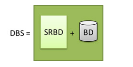
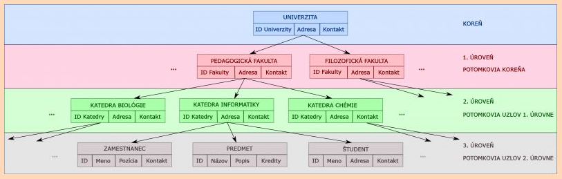
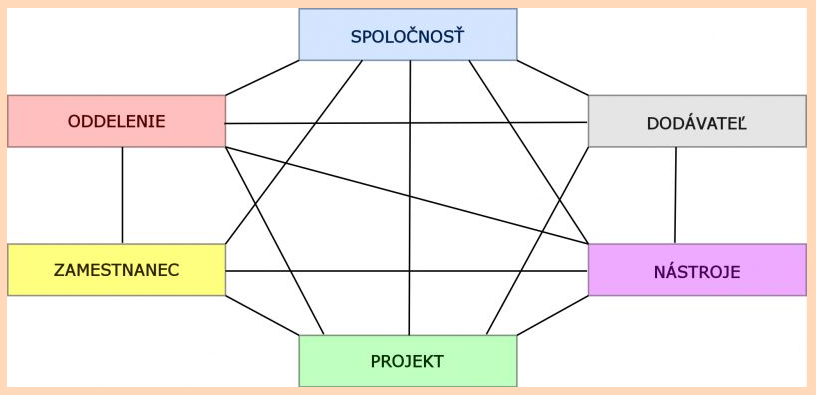
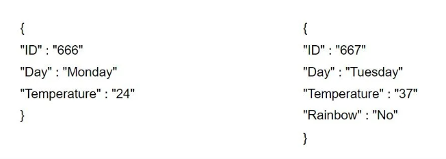
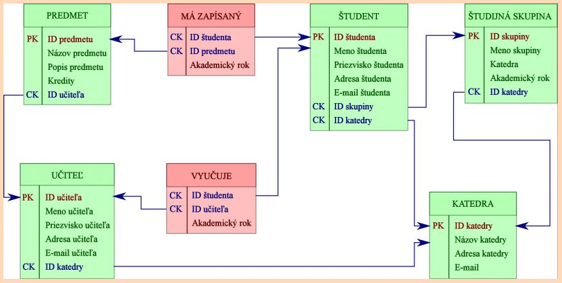
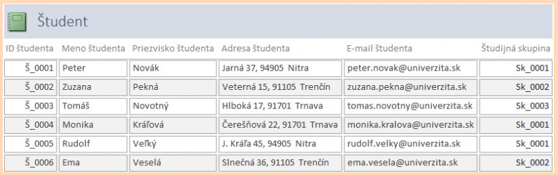
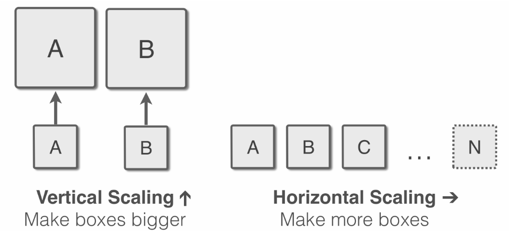
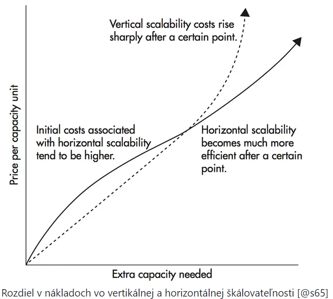
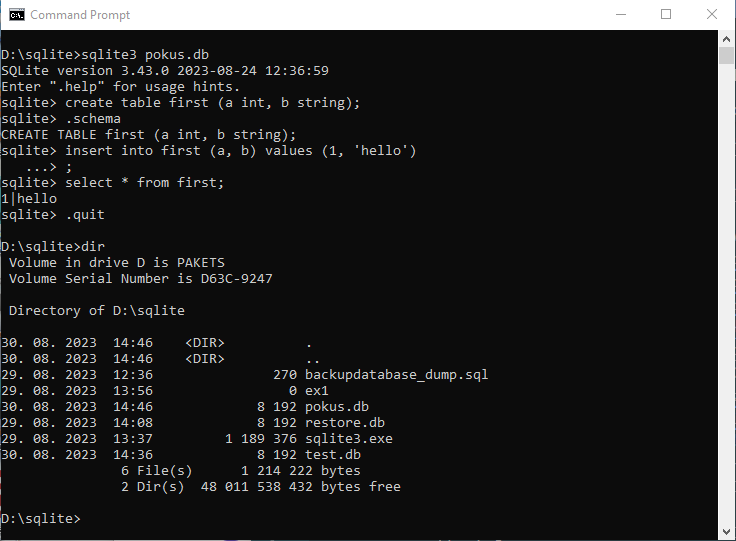
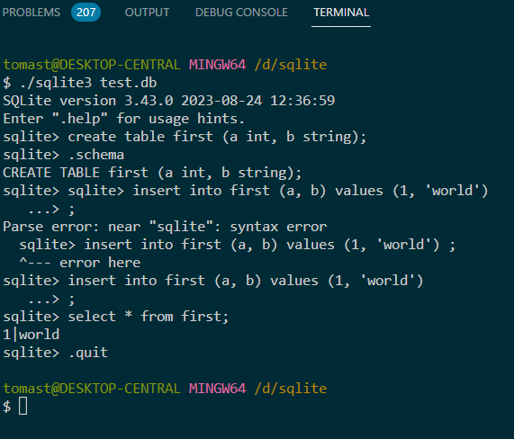

> # 7. Úvod do databázových systémov

## 7.1 Definícia databázového systému

Databázový systém (DBS) tvorí srdce informačného systému. Pod databázovým systémom chápeme množinu navzájom súvisiacich údajov spoločne s programovým vybavením, ktoré umožňuje prístup k týmto údajom a narábanie s nimi.

Kde **DBS** – **D**ata**B**ázový **S**ystém, **SRBD** – **S**ystém **R**iadenia **B**ázy **D**át (angl. DBMS), **DB** – vlastná **D**ata**B**áza

Systém riadenia bázy dát (SRBD) je programové vybavenie, ktoré umožní zabezpečiť všetky požadované vlastnosti databázového systému a manipulovať s údajmi.

>## Najdôležitejšie funkcie DBS:
* pridanie nového prázdneho súboru do databázy,
* vloženie nových údajov do existujúceho súboru,
* výber údajov z existujúceho súboru,
* oprava údajov v existujúcom súbore,
* zrušenie údajov z existujúceho súboru,
* zrušenie existujúceho súboru z databázy.

>## Požiadavky na DBS:
* oddelenie definovania údajov od príkazov na manipuláciu s nimi,
* nezávislosť údajov,
* procedurálne a neprocedurálne rozhranie,
* minimalizáciu redundandancie údajov,
* ochranu proti nekonzistencii údajov,
* zdieľanie údajov,
* bezpečný prístup k údajom,
* integritu údajov.

## Historický prierez databázových systémov

* **Nultá generácia**  
z ktorej sa výchádza sú **systémy súborov**
* **Prvá generácia**\
Prvé počiatky databázových systémov siahajú do 50. rokov. Najstaršie databázové modely využívali správu súborov a jednotlivé údaje sa ukladali sekvenčne do jedného veľkého súboru (magnetické pásky či dierne štítky). V neskorých 60. rokoch a 70. rokoch boli zavedené SRDB a populárnymi sa stali dva údajové systémy: **sieťové a hierarchické databázy**. Princíp hierarchickej databázy je založený na hierarchickej štruktúre údajov. Medzi hlavné nevýhody tohoto databázového modelu patrí, že podriadený záznam sa môže vzťahovať iba k jednému nadriadenému záznamu.

Hierarchický údajový model

Tento nedostatok riešia sieťové databázy. Tieto umožňujú aby určitý záznam mal viac nadradených záznamov.

Sieťový údajový model

* **Druhá generácia**\
V rokoch 1970 – 1972 E. F. Codd definoval **relačný údajový model**. V jeho modeli sa všetky údaje v databáze dajú reprezentovať jednotným spôsobom ako hodnoty v tabuľkách, ktoré je možné vyjadriť matematickým pojmom relácie. Výhodou relačného databázového modelu je zachovanie integrity spracovaných údajov. Na základe tohto modelu je dnes založená väčšina komerčných databázových modelov.
* V roku 1976 S. Chen navrhol nový databázový model **entito-relačný model**. Tento model umožnil návrhárom sústrediť sa na použitie údajov, namiesto logickej štruktúry tabuľky.
* V osemdesiatych rokoch vznikali komerčné relačné systémy (IBM DB2, Oracle). SQL jazyk sa stal priemyselným štandardom.
* **Tretia generácia**\
Pre deväťdesiate roky je charakteristický nástup **objektovo orientovaných databázových systémov**. Jednotlivé záznamy už nie sú tvorené samostatnými hodnotami, ako to bolo v relačných DBS, ale obsahujú vlastné metódy (funkcie), ktoré pracujú s týmito hodnotami. Je pevně spojená s objektovo orientovaným programovaním. Zaťiaľ čo relačné databázy bývajú väčšinou striktne oddelené od aplikácii. A tie objektové zase úzkoe súvisia s s konkrétným programovacím jazykomm jako napr. Perl, Ruby, Java alebo Python. Namiesto tabuliek, ktoré sú typické pre relačné databázy, pracuje objektová databáza priamo s objektami, na ktoré sú naviazané ich vlastnosti a instancie(premenné objektov).

## 7.2 Tradičné databázové systémy
Pod pojmom tradičné DBS môžeme považovať staršie DB systémy pri ktorých ešte neboli použité relačné modely. NoSQL alebo nerelačné databázy sa od relačných databáz líšia tým,že neukladajú data v pevne definovaných tabuľkách. Tým sú veľmi flexibilné lebo netreba pri zmene polí (stĺpcov) upravovať celú tabuľku a naviac dovolujú kombinovať odlišné štruktúry dát bez toho aby sa zasahovalo do schémy DB. Názov NoSQL je však zavádzajúci, lebo v skutočnosti ide o "**N**ot**o**nly**SQL**" (Nie len relačné databázy) ktoré vedia pracovať s SQL príkazmi.  Je viacero podtypov NoSQL databáz ale pre názornosť použijeme variant tzv. ["Document-oriented"](https://www.master.cz/blog/relacni-databaze-nerelacni-databaze-jake-jsou-rozdily/) databázu. Táto dB je založená na ukladaní dát v dokumentoch a to najčastejšie vo formátoch JSON (viď. settings.json tohoto VS-Code), BSON alebo XML. Tieto dokumenty obsahujú klúč a hodnotu ako je to u Pythonu pri slovníkoch (Dictionary).

V našom príklade pridáme do záznamu vpravo klúč „Rainbow”. V relačnej databáze by se musela zmeniť celá tabuľka a ev. urobiť migráciu. V NoSQL to ale neni problém. Kludne by do nej bolo možné pridat záznam, ktorý sa týka úplne niečoho iného ako počasia a nebolo by nutné meniť schému celej databázy ako v prípade databázy relačnej.

Dva záznamy z jednoho JSON dokumentu majú rozdielné kľúče, resp. parametre, bez toho aby sme menili schému celej databázy.

**Výhodou** oproti relačnému modelu je napr. možnosť v jednom dokumente skladovať záznamy (riadky) s odlišnými parametrami. 

## 7.3 Relačné databázové systémy
V súčasnosti sú takmer všetky používané databázové systémy založené na relačnom dátovom modeli. **Podľa výkonu** a **možností resp. rozsahu funkcii**, ktoré poskytujú, ich môžeme zhruba rozdeliť na tzv.**„high-end“** systémy kam patrí napr. Oracle Database, Microsoft SQL Server, IBM DB/2 a pod. a systémy tzv. **„low-end“ kam patrí napr. MySQL, MiniSQL s pod. Medzi nimi nimi sa ešte nachádzajú systémy strednej kategórie ako PostgreSQL, SQLite a pod. 

Okrem nich rozlisujeme samostatnú kategóriu DBS tzv. desktopových relačných databázových systémov, ktoré na rozdiel od tých vyššie spomenutých „plnohodnotných“ systémov **neposkytujú** na vysokej úrovni alebo vôbec pokročilé funkcie, ako napr. **transakčné spracovanie, autorizáciu, robustnosť a zotaviteľnosť, viac-používateľský prístup a distribuovanosť** ale zato sú oveľa lacnejšie a dostupné pre širokú verejnosť . Patria k nim napr. Microsoft Access, dBase, Microsoft FoxPro, Firebird, Interbase, a pod..

Relačný údajový model so zobrazením relácii medzi entitami (tabuľkami)

Príklad relácie v tabuľke "ŠTUDENT" s 9-mi riadkami (raw, Záznami) a 6-mi stĺpcami (Culomn, Poliami) pričom 6. stĺpec zabezpečuje prepojenie - reláciu na tabuľku "ŠTUDIJNÁ SKUPINA"

Porovnanie a obĺúbenosť niektorých DBS nájdeme [**TU**](https://www.master.cz/blog/mysql-postgresql-sqlite-databazove-systemy-rozdily/).

## Výhody a nevýhody relačných a nerelačných databáz
* Významným rozdielom medzi relačnými a nerelačnými DB je ich **škálovateľnosť** resp. možnosť upgradeu hardverových zdrojov za účelom zvýšenia výkonnosti databázového systému ktorý sa väčinou meria pomocou tzv. [benchmarkov](http://tpc.org/default5.asp). U oboch typov je možné škálovať vertikálne

**Vertikálne škálovať** (alebo tiež scale up/down) znamená pridať ďalšie zdroje (alebo odstrániť existujúce) z jedného uzla (zariadenia). Obyčajne sa jedná o zvýšenie výkonu v podobe rýchlejšieho CPU, zvýšenie počtu CPU, zvýšenie RAM alebo zväčšenie diskového priestoru na jednom počítači. 
Tento spôsob škálovania má však svoje limity. Tie sú dané hlavne fyzikálnymi zákonitosťami, resp. možnosťami aktuálnych technológií.

**Horizontálne škálovať** (alebo tiež scale out/in) znamená pripojiť do systému ďalšie uzly (alebo odpojiť existujúce). To docielime pripojením nového počítača do distribuovaného systému. Vlastnosťou horizontálneho škálovania je vybavená väčšina NoSQL databázových systémov.

Samozrejme aj jeden aj druhý prístup má svoje výhody a nevýhody:

**Nerelačná databáza** je však ľahko **škálovaťelná** aj horizontálne, čo v praxi znamená pridávanie ďaľších samostatných serverov. V takomto prípade sa záznamy doplňujú o tzv. „keyspace”, ktorý prezrádza, na ktorom servere sa daná entita vyskytuje. To umožňuje velmi flexibilne pridávať ďalšie zdroje, napr. spoločnosť Apple používa pre svoju nerelačnú databázu cez 75 tisíc serverov.

V prípade relačnej databázy je síce horizontálné škálovanie tiež možné, ale jedná sa o dosť komplikovaný proces. Proto by sme mali vopred vedieť akú bude mať naša DB zhruba veľkosť a aj to čo všetko a ako často sa bude do nej zapisovať a z nej čítať. Jej architektúra se totiž navrhuje vopred a meniť ju za prevádzky je často veľmi problematické. Ak sa ale zvolí nerelačná databáza, dá se mnoho takých vecí podľa potreby riešiť za behu.

**Relačná databáza** je naopak, vzhľadom ku svojej nemennej schéme, veľmi **konzistentná** a vyznačuje se vysokou **integritou dát**. To se hodí pre prípady, kedy záznamy obsahujú vždy rovnaký, alebo alespoň podobný, typ a počet hodnôt, protože se skladujú v rámci pevne danej schémy.

## Pre aký typ databázy sa rozhodnúť

Odhliadnúc od finančných nákladov na HW, zabezpečenie prevádzky a pod. všeobecne platí ak sa náš **projekt bude organicky vyvíjať** a my netušíme koľko dát a v akej podobe budeme postupne skladovať, je na mieste siahnúť po **nerelačnej databáze**, ktorá nás v budúcnosti nebude sväzovať pevnou schémou. Napr. pre zbere analytických dát z rôzných, a časom pribúdajúcich, zdrojov je nerelačná databáza často ideálna voľba.

Naopak v situáci, kedy sa ukládajú nemenné záznamy s prísnou štruktúrou a kedy je možné odhadnúť potrebnú architektúru databázy, bude komfortnejšie zvoliť relačnú databázu. Príkladom môže byť ukladanie transakčních dát alebo tvorba dynamického e-shopu s podobne štruktúrovanými položkami.

>## 7.4 Správa, menežovanie databázových systémov pomocou CLI

 Spravidla každá spoločnosť ktorá ponúka svoj databázový systém ponúka k nemu aj programové prostriedky pre správu a menežovanie svojho DBS. Aj keď tieto prostriedky sa dajú často použiť aj pri iných DBS je vhodné ich uprednostniť na menežovanie DBS pre ktoré boli vytvorené. Pre správu a menežovanie nášho RDBS ktorým bude SQLite použijeme programový nástroj [DB Browser for SQLite](https://sqlitebrowser.org/) resp. [SQLite Studio](https://sqlitestudio.pl/). V tejto časti bude ukázané ako spravovať databázu bez GUI nástroja ako j enapr. SQLIte Studio ale iba pomocou príkazov v príkazovom interpereteri (**C**ommand **L**ine **I**nterpreter) sqlite3. Pre nás je však čas veľmi drahý a preto nám táto ćasť poslúži iba na ukážku že aj takto nepohodlnejšie sa dá DBS spravovať. My túto tému potrebujeme najmä na to že v prípade používanie DBS v kóde Pythonu sa s týmito príkazmi stretneme.

># Python SQLite – Vytvorenie novej databázy

https://www.geeksforgeeks.org/python-sqlite-creating-a-new-database/

https://www.w3schools.blog/create-database-sqlite 

https://www.youtube.com/watch?v=VZ20Lh4zbRo

V tomto časti sa budeme zaoberať tým, ako vytvoriť databázu v SQLite pomocou Pythonu. Na vytvorenie databázy nepotrebujete žiadne špeciálne povolenia, v prípade SQLite nám stačí mať k dispozícii jeho Shell ktorý si môžeme stiahnuť [tu](https://www.sqlite.org/download.html). Spustíme ho napr. v MS Windows okne Command Prompt-u (CMD) príkazom sqlite3 a následným zadaním príkazov na vytvorenie tabulky a jej naplnení údajmi viď. obr.:

~~~
D:\sqlite>cls

D:\sqlite>sqlite3 pokus.db
SQLite version 3.43.0 2023-08-24 12:36:59
Enter ".help" for usage hints.
sqlite> create table first (a int, b string);
sqlite> .schema
CREATE TABLE first (a int, b string);
sqlite> insert into first (a, b) values (1, 'hello')
   ...> ;
sqlite> select * from first;
1|hello
sqlite> .quit

D:\sqlite>cls
D:\sqlite>dir
~~~
alebo v terminalovom okne VS-Code a jeho Git Bash-i:

Vlastný príkaz na vytvorenie databázy sqlite3 má nasledujúcu syntax:
~~~
sqlite>sqlite3 <názov_databázy_s_priponou.db>
~~~
Za týmto príkazom nasledujú ďalšie, ktoré spôsobia vytvorenie tabulky, vloženie hodnôt, ich zobrazenie a ukončenie shellu sqlite. Predposledný príkaz **cls** resp **clear** spôsobí vyčistenie okna a **dir** resp. **ls** zobrazenie obsahu adresára.

Podobne môžeme túto databázu vytvoriť v pythone pomocou modulu SQlite3.
~~~
# new_database.py

import sqlite3

# filename to form database
file = "d:/web_flask/geek_sqlite/Sqlite3.db"

try:
    conn = sqlite3.connect(file)
    print("Database Sqlite3.db formed.")
except:
    print("Database Sqlite3.db not formed.")
~~~
Výstupom je oznam:
~~~
Database Sqlite3.db formed.
~~~
### Pripojenie sa k existujúcej databáze

Vytvorenie úplne novej databázy SQLite je veľmi jednoduché. Ak chcete vytvoriť spojenie, všetko, čo musíte urobiť, je odovzdať cestu k súboru do metódy connect(…) v module sqlite3. Ak databáza reprezentovaná súborom neexistuje, vytvorí sa pod touto cestou.
~~~
import sqlite3 
connection = sqlite3.connect(<cesta_k_súboru_db.sqlite3>)
~~~
Všeobecná syntax metódy connect je nasledovná:
~~~
sqlite3.connect(databáza [, časový limit , ďalšie voliteľné argumenty])
~~~
Použitie tohto API otvára pripojenie k databázovému súboru SQLite. Použite „:memory:“ spôsobí pripojenie k databáze umiestnenej v RAM namiesto pripojenia k databáze umiestnenej na pevnom disku. Objekt Connection vráti informáciu keď sa databáza otvorí správne.

K databáze je možné pristupovať prostredníctvom viacerých pripojení a jedným z procesov je úprava databázy. Databáza SQLite bude visieť, kým nebude transakcia potvrdená. Parameter timeout určuje, ako dlho by malo spojenie čakať na odomknutie, kým sa vyvolá výnimka. Parameter časového limitu 5.0 (päť sekúnd). Ak zadaný názov databázy neexistuje, toto volanie vytvorí databázu. Ak chceme vytvoriť databázové údaje v inom umiestnení, ako je aktuálny adresár, môžeme na určenie názvu súboru použiť aj požadovanú cestu.
#### Niektoré formy implementácie:
1. Vytvorenie spojenia medzi databázou sqlite3 a programom Python
~~~
sqliteConnection = sqlite3.connect('SQLite_Retrieving_data.db')
~~~
2. Ak sqlite3 vytvorí spojenie s programom python, vypíše „Pripojené k SQLite“, inak sa zobrazia chyby
~~~
print("Pripojené k SQLite")
~~~
3. Ak je spojenie otvorené, musíme ho uzavrieť. Uzatvárací kód sa nachádza vo vnútri posledného bloku. Na zatvorenie objektu spojenia použijeme metódu close(). Po zatvorení objektu pripojenia vypíšeme „spojenie SQLite je zatvorené“
~~~
if sqliteConnection: 
    sqliteConnection.close() 
    print("pripojenie sqlite je zatvorené")
~~~
~~~
#some_implement.py

# Importing Sqlite3 Module
import sqlite3

try:
	# Making a connection between sqlite3 database and Python Program
	sqliteConnection = sqlite3.connect('SQLite_Retrieving_data.db')
	# If sqlite3 makes a connection with python program then it will print "Connected to SQLite"
	# Otherwise it will show errors
	print("Connected to SQLite")
except sqlite3.Error as error:
	print("Failed to connect with sqlite3 database", error)
finally:
	# Inside Finally Block, If connection is open, we need to close it
	if sqliteConnection:
		# using close() method, we will close the connection
		sqliteConnection.close()
		# After closing connection object, we will print "the sqlite connection is closed"
		print("the sqlite connection is closed")
~~~

># Ako zobraziť všetky stĺpce v databáze SQLite pomocou Pythonu?

V tejto časti si ukážeme ako môžeme zobraziť všetky stĺpce tabuľky v databáze SQLite z Pythonu pomocou modulu sqlite3 . 
Postup:
* Pripojte sa k databáze pomocou metódy connect() .
* Vytvorte objekt kurzora a použite vytvorený objekt kurzora na vykonávanie dotazov, aby ste vytvorili tabuľku a vložili do nej hodnoty.
* Na získanie názvov stĺpcov použite kľúčové slovo description objektu kurzora. Kľúčové slovo description špecifikuje iba stĺpce tabuľky v dvojrozmernej n-tice, ktorá neobsahuje žiadne hodnoty a iba názvy stĺpcov.

~~~
data=cursor.execute('''SELECT * FROM table_name''')
print(data.description)
~~~
Vyššie uvedený kód zobrazuje všetky stĺpce danej tabuľky v dvojrozmernej n-tici.

* Zobrazte údaje v tabuľke vykonaním nižšie uvedeného dotazu pomocou objektu kurzora.

~~~
SELECT * FROM názov_tabuľky
~~~
* Nakoniec potvrďte zmeny v databáze a zatvorte pripojenie.

## Implementácia:
### Vytvorenie tabuľky
V nižšie uvedenom programe sa pripojíme k databáze s názvom gfg.db, potom vytvoríme tabuľku ZAMESTNANCOV a vložíme do nej hodnoty. Nakoniec vykonáme zmeny v databáze a ukončíme spojenie.
~~~
# create_table.py

# Import module
import sqlite3

# Connecting to sqlite
conn = sqlite3.connect('d:/web_flask/geek_sqlite/gfg1.db')

# Creating a cursor object using the cursor() method
cursor = conn.cursor()

# Creating table
table ="""CREATE TABLE EMPLOYEE(FIRST_NAME VARCHAR(255),
								LAST_NAME VARCHAR(255),
								AGE int,
								SEX CHAR(1),
								INCOME int);"""
cursor.execute(table)
print('Table Created!')

# Queries to INSERT records.
cursor.execute('''INSERT INTO EMPLOYEE(FIRST_NAME, LAST_NAME, AGE, SEX, INCOME)
					VALUES ('Anand', 'Choubey', 25, 'M', 10000)''')
cursor.execute('''INSERT INTO EMPLOYEE(FIRST_NAME, LAST_NAME, AGE, SEX, INCOME)
					VALUES ('Mukesh', 'Sharma', 20, 'M', 9000)''')
cursor.execute('''INSERT INTO EMPLOYEE(FIRST_NAME, LAST_NAME, AGE, SEX, INCOME)
					VALUES ('Ankit', 'Pandey', 24, 'M', 6300)''')
cursor.execute('''INSERT INTO EMPLOYEE(FIRST_NAME, LAST_NAME, AGE, SEX, INCOME)
					VALUES ('Subhdra ', 'Singh', 26, 'F', 8000)''')
cursor.execute('''INSERT INTO EMPLOYEE(FIRST_NAME, LAST_NAME, AGE, SEX, INCOME)
					VALUES ('Tanu', 'Mishra', 24, 'F', 6500)''')

print('Data inserted into the table')

# Commit your changes in the database	
conn.commit()

# Closing the connection
conn.close()
~~~
Výsledok:
~~~
Table Created!
Data inserted into the table
~~~
### Načítavanie stĺpcov z tabuľky

Teraz, ako sme už vytvorili tabuľku a vložili hodnoty do tabuľky v databáze. Napojíme sa na predchádzajúcu databázu, kde je vytvorená tabuľka ZAMESTNANCOV. Potom najskôr zobrazíme všetky stĺpce a potom hodnoty údajov v stĺpci.
~~~
# read_culomn.py

# Import module
import sqlite3

# Connecting to sqlite
conn = sqlite3.connect('d:/web_flask/geek_sqlite/gfg.db')

# Creating a cursor object using the cursor() method
cursor = conn.cursor()

# Display columns
print('\nColumns in EMPLOYEE table:')
data=cursor.execute('''SELECT * FROM EMPLOYEE''')
for column in data.description:
	print(column[0])
	
# Display data
print('\nData in EMPLOYEE table:')
data=cursor.execute('''SELECT * FROM EMPLOYEE''')
for row in data:
	print(row)
	
# Commit your changes in the database	
conn.commit()

# Closing the connection
conn.close()
~~~ 

Otázky k téme:

1./ 