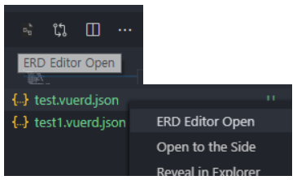

>## Modely a modelovanie databáz

Spravidla sa v tejto oblasti stretávame s platenými nástrojmi pre profesionálne použitie alebo ako súčasť balíkov robustných DBS. Patria k nim napríklad:
* [Enterprise Architect](http://www.sparxsystems.com.au/)
* [Sybase PowerDesigner](https://sybase-powerdesigner.informer.com/)
* [MagicDraw](https://www.3ds.com/products-services/catia/products/no-magic/magicdraw/)

Pre naše účely nám budú však postačovať menej robustné a zložité nástroje. Aj vo VS-Code máme jeden z nich ktorý nájdeme cez rozšírenie (extension), Je to [Editor ERD](https://marketplace.visualstudio.com/items?itemName=dineug.vuerd-vscode) (**E**ntity-**R**elationship **D**iagram Editor) ktorý môžeme za týmto účelom použiť. Tak si ho pozrime. Vytvoríme si v našom adresári súbor nasledovného tvaru:
~~~
[meno_suboru].vuerd.json
~~~
Otvorte súbor a kliknite na ikonu Vuerd v pravom hornom rohu okna editora alebo kliknite pravým tlačidlom myši na súbor -> Otvoriť editor

Videonávod k používatiniu tohoto editora nájdeme [**tu**](https://www.youtube.com/watch?v=bop3heL6d5s)

Tento spustíme kombináciou tlačítok Ctrl+Shift+P, vyberom bigER: new Empty ER Model a zadaním jeho mena ktoré následne uložíme. Jeho používanie je trochu menej komfortné nakoľko vyžaduje [textové notácie](https://github.com/borkdominik/bigER/wiki/Notations#overview-of-er-notations).

My si však ako nástroj vytvárania modelov zvolíme [drawio](https://drawio-app.com/blog/entity-relationship-diagrams-with-draw-io/) nakoľko nám okrem ER diagramov ponúka aj tzv. Class diagramy ktoré budeme používať pri modelovaní Python OOP kódu. Okrem týchto dvoch možností sa tu nachádza ešte [celý rad](https://www.drawio.com/example-diagrams) ďalšich diagramov z UML (**U**nifed **M**odeling **L**anguage). Tento nástroj má svoju [internetovú verziu](https://app.diagrams.net/) a desktopovú verziu ktorú si môžeme stiahnúť [**tu**](https://www.drawio.com/). K dispozícii je aj [video kurz](https://www.youtube.com/watch?v=OQcWiFA5B_0) a [samoučiaci kurz](https://drawio-app.com/blog/draw-io-self-directed-training-course/).

S veľkou pravdepodobnosťou bude potrebné aby ste vo vašej záverečnej práci priložili aj túto formu popisu a tak vás hlbšie poznanie drawio neobíde. My si spoločne preberieme iba niektoré základné postupy ako používať drawio pre vytváranie ER diagramov. Neskôr pri OOP v Pythone na aplikovanej informatike ho použijeme na vytváranie class diagramov. Aj dravio môžeme používať prostredníctvom extensions vo VS-Code. Z nášho pohľadu hendykepom tohoto nástroja jr to že z nakresleného ER diagramu nevie vygenerovať SQL skript (ako napr. Editor ERD) ktorý je rovno možné použiť na vytvorenie databázy. Je to iba grafický nástroj ktorého výstup nám poslúži pre vytváranie databázy napr. v SQLite Studio. Samozrejme že existujú [výkonnejšie nástroje](https://www.geeksforgeeks.org/top-data-modeling-tools/) ktoré sú spravidla špecializované na ER modelovanie a ktoré umožňujú okrem generovania databázového systému uskutočňovať aj tzv. [**reverse engeenering**](https://www.google.com/search?q=er+diagram+tool+free+reverse+engineering&sca_esv=573626709&sxsrf=AM9HkKnhAImdIYiGWec6DveKmn5ZCntYFg%3A1697390873720&ei=GSEsZcK7K9qV9u8P_sqYsAY&oq=free+er+diagram+reverse&gs_lp=Egxnd3Mtd2l6LXNlcnAiF2ZyZWUgZXIgZGlhZ3JhbSByZXZlcnNlKgIIATIGEAAYFhgeMgYQABgWGB5Ilt8BUABYulZwAHgBkAEAmAGUAaABixOqAQQ2LjE3uAEByAEA-AEBwgIEECMYJ8ICBxAjGIoFGCfCAgcQABiKBRhDwgIREC4YgAQYsQMYgwEYxwEY0QPCAgsQABiABBixAxiDAcICDRAuGIoFGMcBGNEDGEPCAgQQLhgDwgIIEAAYgAQYsQPCAgwQIxiKBRgTGIAEGCfCAgUQABiABMICCxAAGIoFGLEDGIMBwgIIEAAYywEYgATCAgUQIRigAcICCBAhGBYYHhgd4gMEGAAgQYgGAQ&sclient=gws-wiz-serp#ip=1) t.j. vytvorenie ER diagramu z daného DBS.