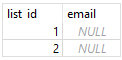

>## Integrita databázových systémov

### Pojem databázovej integrity

Pojem integrity dát v sebe zahrňuje následúce význami:\
1./ Je to **stav**, kedy **prečítané údaje sú totožné s údajmi uloženými v DB**. Tzn. že počas ukladania (prenosu) dat nedošlo k ich neočekávaným zmenám.\
2./ **Obsahuje zaistenie kompletnosti dát**. Napríklad osobné číslo patrí nejakej osobe. Keď by osobné číslo nikomu nepatrilo, jedná sa o osirelé alebo nekompletné data.\
3./ **Zachovanie dát** pre ich ďalšie uvažované použitie.

**Integrita databázy znamená, že databáza zodpovedá zadaným pravidlám** – integritným obmedzeniam. Tieto integritné obmedzenia sú súčasťou definície databázy resp. atribútov jej tabuliek, a **za ich splnenie zodpovedá systém riadenia bázy dát** (DBMS - Database Management System). Je to programové vybavenie ktoré zabezpečuje prácu s databázou a tvorí rozhranie medzi uloženými údajmi a človekom resp. aplikačnými programami. K týmto SW patria aj nástroje ktoré už poznáme pri manažovaní datáz. Ide o SQLite, SQLite Studio a pod.

### Obmedzenie integrity

Do obmedzenia v logickom návrhu sa premietajú aplikačné pravidlá z konceptuálneho návrhu databázy. **Obmedzenie integrity je pri tom také obmedzenie, ktoré zvyšuje presnosť dát v databáze**. Podstatnou výhodou je, že tieto obmedzenia sú zaisťované automaticky relačným databázovým systémom, a že ako užívatelia ich nemôžeme obísť (okrem databázového administrátora). 

**Integritné omedzenia sa môžu týkať jednotlivých hodnôt vkladaných do polí databázy** (napríklad známka z predmetu musí byť v rozsahu 1 až 5). Asi si vieme všetci veľmi dobre predstaviť aký chaos by nastal v údajoch keby takéto obmedzenie v súvislosti so stupnicou známok nebolo definované. Môže íst **tiež o podmienku na kombináciu hodnôt v niektorých poliach jedného záznamu** (napríklad dátum narodenia nesmie byť neskorší ako dátum umrtia). Integritné omezenia se **môžu týkať aj celej množiny záznamov daného typu** – môže ísť o požadavku na unikátnosť hodnôt daného poľa či kombinácie polí v rámci celej množiny záznamov daného typu, které sa v databáze vyskytujú (napríklad číslo preukazu v záznamoch o osobách).

### Druhy obmedzení integrity

Velmi často používaným integritním omezením v relačních databázích je tzv. **referenčná integrita**. Je to **zaistenie zachovania vzťahov medzi reláciami**. Jedná sa o požiadavu, aby pre pole záznamu, ktoré má obsahovať odkaz na iný záznam niekde v databáze, takýto odkazovaný záznam skutočne existoval. Teda **aby** taký **odkaz neviedol „do prázdna“** na nexistujúci záznam a nejednalo sa o tzv. databázového sirotka.

Ďalšími druhmi obmedzenia integrity sú:

* Doménová integrita a 
* Entitná integrita

**Doménová integrita** zajisťuje, že **každá hodnota v danom stĺpci má vyžadovaný typ**, prípadne rozsah, např. nezáporné párne čísla alebo písmená A, B alebo C. Zložité obmedzenie môže vyžadovať riešenie pomocov trigerov. 

**Trigger** (slovensky spúšťač) v databáze definuje činnosti, ktoré sa majú vykonať v prípade definovanej udalosti nad databázovou tabulkou. Definovanou udalosťou môže byť napr. vloženie alebo zmazanie dát. Jednoduchý spúšťač, který sa má vykonať pred vložením nového záznamu do tabuľky môže mať v SQL takýto zápis:
~~~
CREATE TRIGGER meno_triggeru BEFORE INSERT
     ON meno_tabulky
 BEGIN
     -- samotný kód spúšťača
 END;
~~~

V prípade **entitnej integrity** sa má zabezpečiť aby každý riadok (záznam) v databázovej tabulke bol jednoznačně rozlišitelný – teda **aby záznam obsahoval nejakú hodnotu ktorá je v rámci databázovej tabuľky unikátna**. K tomuto účelu slúži primárny kľúč.

>#### Platí, že každý riadok tabuľky musí obsahovať primárny kľúč, ktorý bude unikátny vzhľadom k ostatným riadkom a nebude mať hodnotu NULL (žiadny údaj).

### Typy na obmedzenie integrity databázy

Ide o komplexnejšie definíce kontrol, ktoré sa budú vykonávať pri každom pokuse o zápis záznamu do databázy. 

Najdôležitejšími typmi obmedzenia integrity sú obmedzenie typu **NOT NULL**, obmedzenie pomocou **CHECK** a obmedzenie zabezpečené pomocou **trigera** a **PK**.

>### Obmedzenie NOT NULL

Potrebujeme vedieť ako použiť  **NOT NULL** v SQLite, aby sme sa uistili, že hodnoty v stĺpci **nie sú NULL** t.j. že tam nejaké sú a **poľe nie je prázdne**.

Pri vytváraní tabuľky môžete určiť, či stĺpec prijíma hodnoty NULL alebo nie. V predvolenom nastavení všetky stĺpce v tabuľke akceptujú hodnoty NULL okrem toho, ak explicitne používate obmedzenia NOT NULL. Ak chcete definovať NOT NULLobmedzenie pre stĺpec, použite nasledujúcu syntax:
~~~
CREATE TABLE table_name (
    ...,
    column_name type_name NOT NULL,
    ...
);
~~~

Na rozdiel od iných obmedzení, ako sú PRIMARY KEY a CHECK, obmedzenia **NOT NULL sa definujú iba na úrovni stĺpca, nie na úrovni tabuľky**.

To či sú hodnoty NOT NULL pre dané poľe povolené vidíme pri definovaní štruktúry tabuľky pomocou SW (napr. SQLite Studio) či je nám táto voľba ponúknutá. Po pripojení obmedzenia NOT NULL k stĺpcu to spôsobí že každý pokus o nastavenie hodnoty na NULL v poli stĺpca (napr. pri vložení alebo aktualizácii) vyvolá porušenie obmedzenia.

*Príklad použitia NOT NULL:*

Vytvoríme si pomocou SQL (**S**tructured **Q**uery **L**anguage) príkazov novú tabuľku s názvom *suppliers*. Nič nám však nebráni aby sme použili GUI SQLite Studio alebo tento kod vložili do ˇjeho príslušnej záložky:
~~~
CREATE TABLE suppliers(
    supplier_id INTEGER PRIMARY KEY,
    name TEXT NOT NULL
);
~~~

V tomto príklade *supplier_id* je PRIMARY KEY stĺpec tabuľky suppliers. Pretože tento stĺpec je deklarovaný ako INTEGER PRIMARY KEY, nebude akceptovať hodnoty NULL .

Aj keď stĺpec nemáme deklarovaný s NOT NULL, bude akceptovať iba hodnoty iné ako NULL. Je to dané tým že sme mu priradili PRIMARY KEY

Nasledujúcim príkazom sa pokúsime vložiť  do stĺpca *name* v tabuľke supplier:
~~~
INSERT INTO suppliers(name)
VALUES(NULL);
~~~
Cybové hlásenie nám nasledne oznámi že došlo k zlyhaniu transakcie (zápisu) z dôvodu porušenia obmedzenia NOT NULL.
~~~
SQL Error [19]: [SQLITE_CONSTRAINT]  Abort due to constraint violation (NOT NULL constraint failed: suppliers.name)
~~~

>### Obmedzenie NOT NULL

Aby sme zabezpečili, že všetky hodnoty v stĺpci alebo v skupine stĺpcov budú jedinečné t.j. navzájom odlišné používame obmedzenie **UNIQUE**.

Ak chcete definovať obmedzenie UNIQUE, použite kľúčové slovo UNIQUE, za ktorým nasleduje jeden alebo viacero stĺpcov. Obmedzenie UNIQUE môžeme definovať **na úrovni stĺpca alebo celej tabuľky**. Definovať obmedzenie UNIQUE vo viacerých stĺpcoch môžeme iba na úrovni tabuľky. Nasledujúci príklad ukazuje, ako definovať obmedzenie UNIQUE pre stĺpec **na úrovni stĺpca**:
~~~
CREATE TABLE table_name(
    ...,
    column_name type UNIQUE,
    ...
);
~~~
**Na úrovni tabuľky** konštrukcia bude vyerať takto:
~~~
CREATE TABLE table_name(
    ...,
    UNIQUE(column_name)
);
~~~
**Pre viacero stĺpcov** konštrukcia bude vyerať takto:
~~~
CREATE TABLE table_name(
    ...,
    UNIQUE(column_name1,column_name2,...)
);
~~~
Ak po zadefinovaní obmedzenia UNIQUE, ak sa pokúsite vložiť alebo aktualizovať hodnotu, ktorá už v stĺpci existuje, SQLite vydá chybu a preruší operáciu.

*Prílady použitia UNIQUE*:

**Definovanie obmedzenia UNIQUE pre jeden stĺpec**

Nasledujúci príkaz vytvorí novú tabuľku s názvom contacts s obmedzením UNIQUE definovaným pre stĺpec email:

CREATE TABLE contacts(
    contact_id INTEGER PRIMARY KEY,
    first_name TEXT,
    last_name TEXT,
    email TEXT NOT NULL UNIQUE
);

Nasledujúci príklad vloží do tabuľky nový riadok contacts :
~~~
INSERT INTO contacts(first_name,last_name,email)
VALUES ('John','Doe','john.doe@gmail.com');
~~~
Ak sa pokúsite vložiť nový kontakt s rovnakým e-mailom, zobrazí sa chybové hlásenie:
~~~
INSERT INTO contacts(first_name,last_name,email)
VALUES ('Johnny','Doe','john.doe@gmail.com');
~~~
Dostaneme chybové hlásenie:
~~~
Error while executing SQL query on database 'chinook': UNIQUE constraint failed: contacts.email
~~~

**Definovanie obmedzenia UNIQUE pre viacero stĺpcov**

Nasledujúci príkaz vytvorí  *shapes* s obmedzením UNIQUE definovaným pre stĺpce background_color a foreground_color:
~~~
CREATE TABLE shapes(
    shape_id INTEGER PRIMARY KEY,
    background_color TEXT,
    foreground_color TEXT,
    UNIQUE(background_color,foreground_color)
);
~~~
Nasledujúci príkaz vloží do tabuľky *shapes* nový riadok  :
~~~
INSERT INTO shapes(background_color,foreground_color)
VALUES('red','green');
~~~
Nasledujúce vyhlásenie funguje, pretože nedochádza k porušeniu duplicity v oboch stĺpcoch background_colora foreground_colorstĺpcoch:
~~~
INSERT INTO shapes(background_color,foreground_color)
VALUES('red','blue');
~~~
Nasledujúce vyhlásenie však spôsobuje chybu v dôsledku duplikátov v oboch stĺpcoch background_color a foreground_color:
~~~
INSERT INTO shapes(background_color,foreground_color)
VALUES('red','green');
~~~
Dostaneme chybu:
~~~
Error while executing SQL query on database 'chinook': `UNIQUE` constraint failed: shapes.background_color, shapes.foreground_color
~~~

**Definovanie obmedzenia UNIQUE a NULL pre jeden stĺpec**

Menežovaci SW (napr.SQLite) považuje **všetky hodnoty NULL za odlišné**, preto stĺpec s obmedzením UNIQUE môže mať viacero hodnôt NULL.

Nasledujúci príkaz vytvorí novú tabuľku s názvom *lists*, ktorej stĺpec *email* má obmedzenie UNIQUE:
~~~
CREATE TABLE lists(
    list_id INTEGER PRIMARY KEY,
    email TEXT UNIQUE
);
~~~
Príkaz vloží viacero hodnôt NULL do stĺpca *email* tabuľky *lists*:
~~~
INSERT INTO lists(email)
VALUES(NULL),(NULL);
~~~
Príkazom SELECT sa spýtame aké všetky údaje ( použitím * ) sa nachádzajú v tabuľke *lists*:
~~~
SELECT * FROM lists;
~~~

Tu je výstup:

Ako vidíme, aj keď má stĺpec e-mailu obmedzenie UNIQUE, môže akceptovať viacero hodnôt NULL.

>### Obmedzenie CHECK

Ak budeme chcieť v záujme zachovania integrity DBS overovať údaje pred vložením alebo aktualizáciou môžeme použiť obmedzenie CHECK.

Obmedzenia **CHECK** nám umožňujú definovať výrazy na testovanie hodnôt vždy, keď sú vložené alebo aktualizované **v rámci stĺpca**. Ak hodnoty nespĺňajú kritériá definované výrazom, dostaneme správu o porušení obmedzenia a zruší sa príkaz.

Obmedzenia CHECK nám umožňujú definovať ďalšie kontroly integrity údajov nad rámec UNIQUE alebo  NOT NULL, tak aby vyhovovali vašej konkrétnej aplikácii. SW SQLite a SQLite Studio nám umožňuje definovať obmedzenie **CHECK na úrovni stĺpca alebo na úrovni tabuľky**.

Nasledujúci zápis ukazuje, ako definovať obmedzenie CHECK **na úrovni stĺpca**:
~~~
CREATE TABLE table_name(
    ...,
    column_name data_type CHECK(expression),
    ...
);
~~~
a nasledujúci vyraz zase ilustruje, ako definovať obmedzenie CHECK **na úrovni tabuľky**:
~~~
CREATE TABLE table_name(
    ...,
    CHECK(expression)
);
~~~
V tejto syntaxi vždy CHECK, keď sa do tabuľky vloží riadok alebo sa aktualizuje existujúci riadok, vyhodnotí výraz spojený s každým obmedzením a vráti sa číselná hodnota 0 alebo 1. Ak je **výsledok nula, došlo k porušeniu obmedzenia**. Ak je výsledkom **nenulová hodnota alebo NULL**, znamená to, že **nedošlo k porušeniu obmedzenia**.

Všimnite si, že výraz obmedzenia CHECK nemôže obsahovať poddotaz t.j. ďaľší CHECK.

*Prílady použitia CHECK*:

**Definovanie obmedzenia CHECK na úrovni stĺpca**

Nasledujúci príkaz vytvorí novú tabuľku s názvom *contacts*:
~~~
CREATE TABLE contacts (
    contact_id INTEGER PRIMARY KEY,
    first_name TEXT    NOT NULL,
    last_name  TEXT    NOT NULL,
    email      TEXT,
    phone      TEXT    NOT NULL
                    CHECK (length(phone) >= 10) 
);
~~~
V tabuľke *contacts* má stĺpec *phone* obmedzenie CHECK:
~~~
CHECK (length(phone) >= 10) 
~~~
Toto obmedzenie CHECK zabezpečuje, že hodnoty v  *phone* musia mať aspoň 10 znakov. Ak sa pokúsite vykonať nasledujúcu konštrukciu, zobrazí sa chyba porušenia obmedzenia:
~~~
INSERT INTO contacts(first_name, last_name, phone)
VALUES('John','Doe','408123456');
~~~
Chybové hlásenie vyzerá nasledovne:
~~~
Result: CHECK constraint failed: contacts
~~~
Dôvodom bolo, že telefónne číslo, ktoré ste sa pokúsili vložiť, má iba 9 znakov, pričom sa vyžaduje aspoň 10 a viac znakov.

Nasledujúci príkaz by však fungovať mal, pretože hodnota v phonestĺpci má 13 znakov, čo vyhovuje výrazu v obmedzení CHECK:
~~~
INSERT INTO contacts(first_name, last_name, phone)
VALUES('John','Doe','(408)-123-456');
~~~

**Definovanie obmedzenia CHECK na úrovni tabuľky**

Nasledujúci príkaz vytvorí novú tabuľku s názvom *products*:
~~~
CREATE TABLE products (
    product_id   INTEGER         PRIMARY KEY,
    product_name TEXT            NOT NULL,
    list_price   DECIMAL (10, 2) NOT NULL,
    discount     DECIMAL (10, 2) NOT NULL
                                DEFAULT 0,
    CHECK (list_price >= discount AND 
        discount >= 0 AND 
        list_price >= 0) 
);
~~~
V tomto príklade je obmedzenie CHECK definované na úrovni tabuľky:
~~~
CHECK (list_price >= discount AND 
            discount >= 0 AND 
            list_price >= 0) 
~~~
Obmedzenie zaisťuje CHECK, že katalógová cena je vždy väčšia alebo rovná zľave a zľava aj katalógová cena sú väčšie alebo rovné nule.

Nasledujúca konštrukcia porušuje obmedzenie CHECK, pretože zľava je vyššia ako katalógová cena.
~~~
INSERT INTO products(product_name, list_price, discount)
VALUES('New Product',900,1000);    
~~~
Nasledujúca konštrukcia tiež porušuje CHECK, pretože zľava je záporná:
~~~
INSERT INTO products(product_name, list_price, discount)
VALUES('New XFactor',1000,-10);    
~~~

**Definovanie obmedzenia CHECK pridaním do existujúcej tabuľky**

Ak nejaká verzia menežovacieho SW (napr. SQLite od verzie 3.25.2) **nepodporuje pridanie obmedzenia CHECK** do existujúcej tabuľky a porebujeme ho implementovať. Môžeme postupovať podľa týchto krokov:

* Najprv **vytvoríme novú tabuľku**, ktorej štruktúra je rovnaká ako tabuľka, do ktorej sme chceli pridať obmedzenie CHECK. Táto nová tabuľka by už mala obsahovať aj obmedzenie CHECK:
~~~
CREATE TABLE new_table (
    [...],
    CHECK ([...])
);
~~~
Ak sa nepozriete do GUI na štruktúry resp. chcete získať SQL skript ktorý upravíte, môžete použiť príkaz **.schema**. Viac informácií nájdete v [návode na tabuľku SQLite DESCRIBE](https://www.sqlitetutorial.net/sqlite-describe-table/).

* Po druhé, skopírujeme údaje zo starej tabuľky do novej tabuľky.
~~~
INSERT INTO new_table SELECT * FROM old_table;
~~~
* Po tretie, zrušíte starú tabuľku:
~~~
DROP TABLE old_table;
~~~
* Po štvrté, premenujete novú tabuľku na starú:
~~~
ALTER TABLE new_table RENAME TO old_table;
~~~
Aby boli všetky vyššie uvedené príkazy bezpečné, mali by ste ich všetky vykonať postupne v rámci transakcie, ako je táto:
~~~
BEGIN;
-- create a new table 
CREATE TABLE new_table (
    [...],
    CHECK ([...])
);
-- copy data from old table to the new one
INSERT INTO new_table SELECT * FROM old_table;

-- drop the old table
DROP TABLE old_table;

-- rename new table to the old one
ALTER TABLE new_table RENAME TO old_table;

-- commit changes
COMMIT;
~~~
Pojem transakcie máme podrobnejšie vysvetlený [**tu**](https://www.sqlitetutorial.net/sqlite-transaction/)

Otázky k téme:

1./ Čo je to integrita databázy ?
2./ Prečo musíme zabezpečiť integritu databázy ?
3./ Akým spôsobom zabezpečime integritu databázy ?
4./ Čo sú to obmedzenia integrity ?
5./ Aké druhy obmedzenia integrity poznáme ?
6./ Aké typy na obmedzenie  používame ?
7./ Vysvetlite pojmy NOT NUL, CHECK, UNIQUE, PK.
8./ Aké SW nástroje môžeme použiť na definovanie obmedzenia integrity ?
