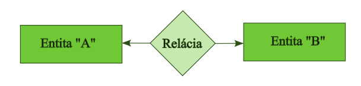
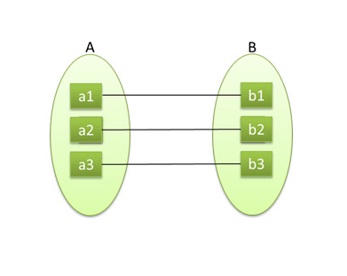
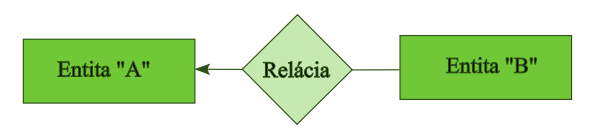
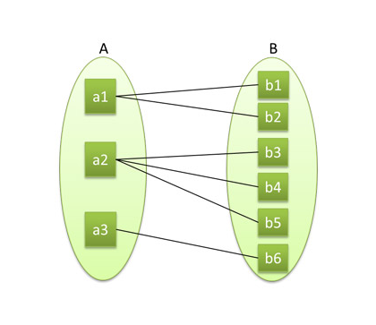
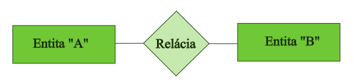
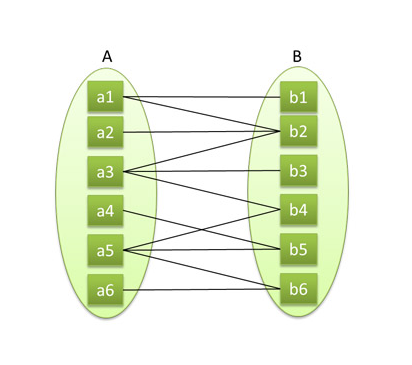
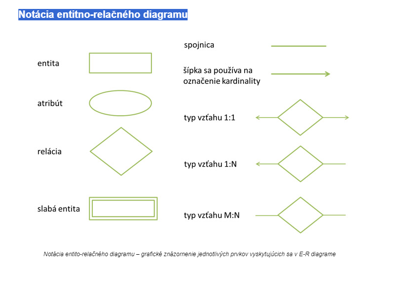

># Vzťahy medzi ntitami a ich notácie

Na predchádzajúcich príkladoch niektorých nástrojov na modelovanie DBS sme sa stretli s prepojeniami (reláciami) medzi tabuľkami (entitami). Je to kľúčová téma pre tvorbu DBS a v tejto súvislosti je potrebné vedieť aké relácie poznáme, ako ich označujeme a najmä čo ktorá relácia znamená resp. ako je potrebné ju interpretovať. Len tak ich budeme totiž vedieť používať v modelovaní a pri návrhu DBS.

### Kardinalita - mohutnosť počtu prvkov množiny

Kardinalita vyjadruje počet entít, ktoré môžu byť viazané s inou entitou na základe relácie, je to vlastne maximálny počet inštancií jednej entity, ktoré môžeme asociovať s jednou inštanciou inej entity. Existujú tri všeobecné typy kardinality a to **1 : 1, 1 : N a M : N**. Určenie kardinality zvyčajne závisí od reálneho sveta, ktorý modelujeme.

>#### Kardinalita 1:1

Relácia jedna k jednej (1 : 1) je vzťah keď je jedna inštancia entity A vo vzťahu s jednou inštanciou entity B.

Príkladom pre vzťah 1 : 1 je to že **študent má jeden rodný list a každý rodný list patrí práve jednému študentovi**,
ďalším príkladom je európske manželstvo. Každý **manžel má práve jednu unikátnu manželku a každá manželka má práve jedného unikátneho manžela**. (**modelujeme aktuálny stav, nie históriu** obyvateľa, v prípade modelovania histórie nie je možný vzťah 1 : 1 vzhľadom na rozvody).

>#### Kardinalita 1:N

Vzťah jedna k mnohým (1 : N) reprezentuje prípad, keď je na jednej strane jedna inštancia triedy A vo vzťahu s viacerými inštanciami entity B. Pre jednu inštanciu entity A je priradených nula, jedna alebo viac inštancií triedy B, ale pre inštanciu B je priradená práve jedna inštancia entity A. Vzťah jedna k mnohým patrí medzi najobľúbenejšie a najčastejšie používané kardinality.

Príkladom je napr. to že **jeden študent patrí do jednej študijnej skupiny, do jednej študijnej skupiny patrí viac študentov**, alebo jedna katedra má viac pracovníkov, alebo každý pracovník je pridelený práve na jednu katedru, či
**arabské manželstvo kde na jedného muža pripadá viac manželiek** (žien).

>#### Kardinalita M:N

Relácia mnohé k mnohým (M : N) je vzťah, kde vystupuje nula, jedna alebo viac inštancií entít na oboch stranách. Početnosti m a n nemusia byť rovnaké čísla!

Príkladom vzťahu N : M je vzťah medzi entitami študent a predmet, pretože **jeden študent si môže zapísať M predmetov a na jeden predmet je zapísaných N študentov**, čo znamená že ide o vzťah M : N. Ďalším príkladom je vzťah vyučujúci a predmet. **Jeden vyučujúci môže učiť viacero predmetov a jeden predmet môžu učiť viacerí vyučujúci**.

### Notácia entitno-relačného diagramu

**Notácia prvkov ER diagramu je grafické znázornenie jednotlivých prvkov** ktoré sa ER diagramoch vyskytujú. 

Táto grafická interpretácia však môže byť u rôznych GUI nástrojoch rôzna. Dôležité je čo vyjadrujú t.j. aky vzťah.

Praktická práca s [dravio](https://www.drawio.com/integrations) 
tu sa nachádza inštalácia pre PC https://github.com/jgraph/drawio-desktop/releases/tag/v22.0.3 ale možno využívať aj online internetovú verziu https://app.diagrams.net/?src=about

Video Použitie E-R diagram nájdeme tu https://www.youtube.com/watch?v=lAtCySGDD48