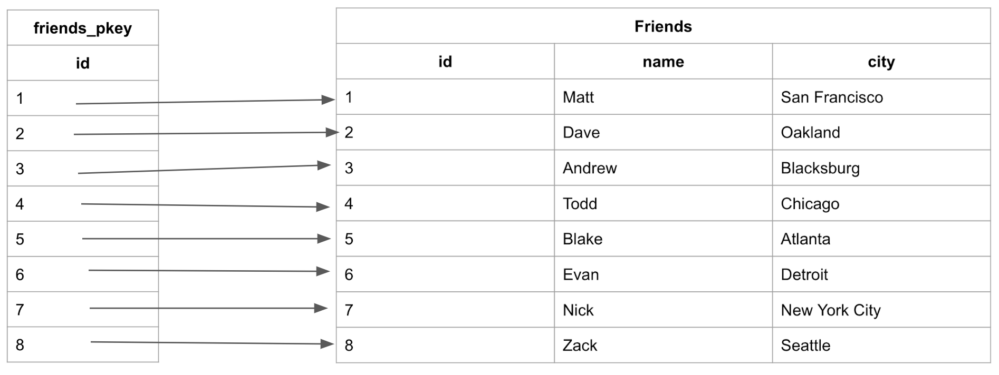
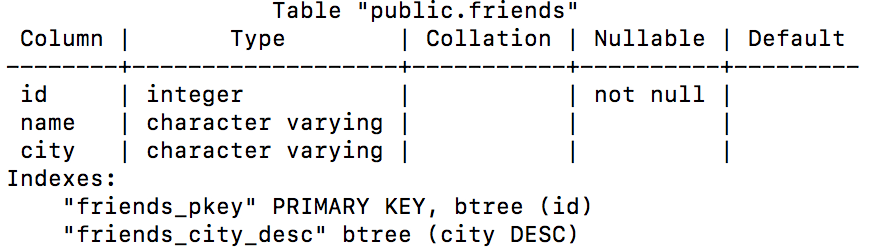

>## Úvod do indexov databázového systému

https://www.atlassian.com/data/sql/how-indexing-works
### Čo je index a kde sa používa

Priradiť index určitému poľu (hlavička stĺpca v tabuľke)= uloženie informácie o usporiadaní údajov v záznamoch (riadkoch tabuľky) vo forme špecianej tabuľky kde sa tieto informácie neustále udržujú (aktualizujú). Tým sa zabezpečujú dve funkcie:

1./ Zrýchluje sa vyhľadávanie záznamov podľa indexovaného poľa (ako príklad poslúži abecedne neusporiadaný a abecedne usporiadaný telefónny zoznam)

2./ Vytvorenie jednoznačného identifikátora príslušného záznamu (využíva sa to pri vytváraní väzieb medzi záznamami viď. súvislošť Primary a Secondary Key)

### Zložené indexy a indexy špeciálneho významu

Bežne naviac indexujeme tie **polia tabuľky**, pri ktorých je predpoklad, že **budú využité pri vyhladávaní záznamov**. 

**Pri vkladaní nového záznamu s už existujúcim obsahom ktorý je v stĺpci indexu je zápis do DB odmietnutý**. Okrem toho že sa hodnota indexu nesmie opakovať ale musí byť zadaná. 

>#### Index musí byť vždy [ordinárneho dátového typu](chrome-extension://efaidnbmnnnibpcajpcglclefindmkaj/https://gabinfo.szm.com/11_Ordinarne_udajove_typy_a_operacie_nad_nimi.pdf) ktoré sa vyznačujú tým, že ich hodnoty sú usporiadané podľa veľkosti od najmenšej po najväčšiu, napr. 0, 1, 2, 3, ...

V pozadí sa automaticky uskutočňuje vlastná indexacia ktorú vidíme na ľavom okraji tabuľky.

Napr. ak by sme mali v tabuľke *studenti* ktorá obsahuje polia ako *priezvisko*, *meno*, *datum_narodenia*, *rocnik*, *studijna_skupina* atď. tak je predpoklad že budeme vyhladávať údaje o študentovi tak, že do vyhladávacieho formulára budeme chcieť zadať jeho priezvisko...

#### Zložený index
Niekedy je však potrebujeme objekt nášho záujmu bližšie špecifikovať a preto je výhodné zaviesť **zložený resp. viaczložkový index**. V našom prípade by to mohol byť okrem indexu **priezvisko** aj **meno** (priezvisko + meno) prípadne **rocnik** (priezvisko + meno + rocnik)

#### Indexy špeciálneho významu

Index ktorý jednoznačne identifikuje príslušný záznam =
 **primárny kľúč (Primary Key)** 
 
 Zvyčajne sa používa automaticky generované čislo datového typu **INTEGER**. Takýto kĺúč sa používa na vytváranie väzieb (relácii) takže tento kĺúč spolu s **Foreing Key** vytvárajú **vzťahy medzi tabuľkami** zatiaľ čo indexy vytvárajú **vzťahy v rámci tabuľky**.

#### Primárny a cudzí kĺúč

 Relačný model popisuje vzťah tabulkou, v ktorej sú popísané objekty vzťahu:

 

 Dobre navrhnutá  tabuľka datázy, obsahuje jeden stĺpec alebo viac stĺpov ktorých hodnoty sa nikdy nemôžu opakovať a jednoznačne určujú jednotlivé záznamy. Tomuto stĺpcu sa hovorí **vlastný či primárny kĺúč** (**P**rimary **K**ey).

 Stĺpec ktorého hodnoty môžeme použiť v inej tabuľke ako kľúč odkazujúci na stĺpec primárny sa volá **cudzí či sekundárny kĺúč** (**F**oreign **K**ey).

 **VAZBU MEDZI TABUĽKAMI VYTVÁRAME PRÁVE POMOCOU TEJTO DVOJICE šPECIÁLNÝCH INDEXOV**

ÚLOHA - vytvor štruktúru bázy dát t.j. DB tabuľky databázy semester podľa obrázka

* doplniť indexovanie o príklady a použitie demonštrovať na SQLite Studio vytvorením indexu a jeho použitie

Čo je indexovanie?
Indexovanie urýchľuje dopytovanie stĺpcov vytvorením ukazovateľov na miesto, kde sú v databáze uložené údaje.

Predstavte si, že chcete nájsť informácie, ktoré sú vo veľkej databáze. Aby počítač dostal tieto informácie z databázy, bude prezerať každý riadok, kým ho nenájde. Ak sú údaje, ktoré hľadáte, na samom konci, spustenie tohto dotazu by trvalo dlho.

Vizualizácia na nájdenie posledného záznamu:
https://wac-cdn.atlassian.com/dam/jcr:9aae23a8-963b-4874-ace5-59da8fdd9dd8/BasicSearchGif.gif?cdnVersion=1351 

Ak by bola tabuľka zoradená abecedne, vyhľadávanie názvu by mohlo prebiehať oveľa rýchlejšie, pretože by sme mohli preskočiť hľadanie údajov v určitých riadkoch. Ak by sme chceli vyhľadať „Zack“ a vieme, že údaje sú v abecednom poradí, mohli by sme skočiť nadol do polovice údajov a zistiť, či Zack prichádza pred alebo za daný riadok. Potom by sme mohli urobiť polovicu zostávajúcich riadkov a urobiť rovnaké porovnanie.
https://wac-cdn.atlassian.com/dam/jcr:a4f8958d-e2e8-450d-a79a-ce0ea657d909/BinarySearchGif.gif?cdnVersion=1351 

Na nájdenie správnej odpovede boli potrebné 3 porovnania namiesto 8 v neindexovaných údajoch.

Indexy nám umožňujú vytvárať zoradené zoznamy bez toho, aby sme museli vytvárať všetky nové zoradené tabuľky, čo by zaberalo veľa úložného priestoru.

## Čo je to vlastne index?

Index je štruktúra, ktorá obsahuje pole, ktoré index triedi, a ukazovateľ z každého záznamu na príslušný záznam v pôvodnej tabuľke, kde sú údaje skutočne uložené. Indexy sa používajú vo veciach, ako je zoznam kontaktov, kde môžu byť údaje fyzicky uložené v poradí, v akom pridávate kontaktné informácie ľudí, ale je ľahšie nájsť ľudí, keď sú uvedené v abecednom poradí.

Pozrime sa na index z predchádzajúceho príkladu a uvidíme, ako sa mapuje späť k pôvodnej tabuľke Priatelia:

Tu vidíme, že v tabuľke sú uložené údaje zoradené podľa zvyšujúceho sa ID na základe poradia, v ktorom boli údaje pridané. A Index má názvy uložené v abecednom poradí.

## Druhy indexovania

Existujú dva typy databázových indexov:

* Clustered - Zhlukovaný
* Non-Clustered - Nezhlukované

Klastrované aj nezhlukované indexy sú uložené a vyhľadávané ako B-stromy, dátová štruktúra podobná binárnemu stromu. B-strom je „samobalancujúca stromová dátová štruktúra, ktorá uchováva zoradené dáta a umožňuje vyhľadávanie, sekvenčný prístup, vkladanie a mazanie v logaritmickom čase“. V podstate vytvára stromovú štruktúru, ktorá triedi údaje pre rýchle vyhľadávanie.

Tu je B-strom indexu, ktorý sme vytvorili. Naša najmenšia položka je položka úplne vľavo a naša najväčšia položka je položka úplne vpravo. Všetky dotazy by začínali v hornom uzle a postupovali by smerom nadol v strome, ak je cieľová položka menšia ako aktuálny uzol, nasleduje ľavá cesta, ak je väčšia, nasleduje pravá cesta. V našom prípade to overilo Matta, potom Todda a potom Zacka.

Na zvýšenie efektivity mnohé B-stromy obmedzia počet znakov, ktoré môžete zadať do záznamu. B-strom to urobí sám a nevyžaduje obmedzenie údajov stĺpcov. V príklade nad B-stromom nižšie obmedzuje položky na 4 znaky.

## Klastrované indexy
Klastrované indexy sú jedinečný index na tabuľku, ktorý používa primárny kľúč na usporiadanie údajov, ktoré sú v tabuľke. Klastrovaný index zaisťuje, že primárny kľúč je uložený v rastúcom poradí, čo je tiež poradie, ktoré tabuľka uchováva v pamäti.

* Klastrované indexy nemusia byť explicitne deklarované.
* Vytvorené pri vytvorení tabuľky.
* Použite primárny kľúč zoradený vo vzostupnom poradí.

### Vytváranie zoskupených indexov
Klastrovaný index sa automaticky vytvorí, keď je definovaný primárny kľúč:
~~~
CREATE TABLE friends (id INT PRIMARY KEY, name VARCHAR, city VARCHAR);
~~~
Po vyplnení bude tabuľka vyzerať takto:

Vytvorená tabuľka „priatelia“ bude mať automaticky vytvorený klastrový index organizovaný okolo „id“ primárneho kľúča s názvom „friends_pkey“:

Pri vyhľadávaní v tabuľke podľa „id“ umožňuje vzostupné poradie stĺpca optimálne vyhľadávanie. Keďže čísla sú usporiadané, vyhľadávanie môže navigovať v B-strome, čo umožňuje vyhľadávanie prebiehať v logaritmickom čase.

Aby sme však v tabuľke hľadali „meno“ alebo „mesto“, museli by sme sa pozrieť na každý záznam, pretože tieto stĺpce nemajú index. Tu sa stávajú veľmi užitočné indexy bez klastrov.

## Nezhlukované indexy
Neklastrované indexy sú zoradené referencie pre konkrétne pole z hlavnej tabuľky, ktoré držia ukazovatele späť na pôvodné položky tabuľky. Prvý príklad, ktorý sme ukázali, je príkladom nezhlukovanej tabuľky:

Používajú sa na zvýšenie rýchlosti dopytov v tabuľke vytvorením stĺpcov, ktoré sa dajú ľahšie vyhľadávať. Neklastrované indexy môžu byť vytvorené dátovými analytikmi/vývojármi po vytvorení a vyplnení tabuľky.

Poznámka: Neklastrované indexy nie sú nové tabuľky. Neklastrované indexy obsahujú pole, za ktoré sú zodpovedné, a ukazovateľ z každej z týchto položiek späť na úplný záznam v tabuľke.

Môžete si ich predstaviť ako indexy v knihe. Index ukazuje na miesto v knihe, kde môžete nájsť údaje, ktoré hľadáte.

Indexy bez klastrov poukazujú na adresy pamäte namiesto toho, aby ukladali údaje samotné. Vďaka tomu sú dopytovanie pomalšie ako klastrované indexy, ale zvyčajne oveľa rýchlejšie ako neindexovaný stĺpec.

Môžete vytvoriť veľa indexov bez klastrov. Od roku 2008 môžete mať v SQL Serveri až 999 neklastrovaných indexov a v PostgreSQL neexistuje žiadne obmedzenie.

### Vytváranie neklastrovaných databáz (PostgreSQL)
Ak chcete vytvoriť index na zoradenie mien našich priateľov podľa abecedy:
~~~
CREATE INDEX friends_name_asc ON friends(name ASC);
~~~
To by vytvorilo index s názvom „friends_name_asc“, čo naznačuje, že tento index ukladá mená „priateľov“ uložené abecedne vo vzostupnom poradí.

Upozorňujeme, že stĺpec „mesto“ sa v tomto indexe nenachádza. Je to preto, že indexy neukladajú všetky informácie z pôvodnej tabuľky. Stĺpec „id“ by bol ukazovateľom späť na pôvodnú tabuľku. Logika ukazovateľa by vyzerala takto:

## Vytváranie indexov
V PostgreSQL sa príkaz „\d“ používa na zobrazenie podrobností o tabuľke vrátane názvu tabuľky, stĺpcov tabuľky a ich typov údajov, indexov a obmedzení.

Podrobnosti tabuľky našich priateľov teraz vyzerajú takto:

**Dopyt poskytujúci podrobnosti o tabuľke priateľov:** \d friends;

Pri pohľade na obrázok vyššie je „friends_name_asc“ teraz priradeným indexom tabuľky „friends“. To znamená, že plán dotazov, plán, ktorý SQL vytvorí pri určovaní najlepšieho spôsobu vykonania dotazu, začne pri vytváraní dotazov používať index. Všimnite si, že „friends_pkey“ je uvedený ako index, aj keď sme ho nikdy nedeklarovali ako index. Ide o klastrovaný index, na ktorý sa odkazovalo vyššie v článku a ktorý sa automaticky vytvára na základe primárneho kľúča.

Môžeme tiež vidieť, že existuje index „friends_city_desc“. Tento index bol vytvorený podobne ako index mien:

~~~
CREATE INDEX friends_city_desc ON friends(city DESC);
~~~

Tento nový index sa použije na zoradenie miest a bude uložený v obrátenom abecednom poradí, pretože bolo zadané kľúčové slovo „DESC“, skratka pre „zostupne“. To poskytuje našej databáze spôsob, ako rýchlo vyhľadávať názvy miest.

## Vyhľadávanie v indexoch
Po vytvorení indexov bez klastrov s nimi môžete začať dopytovať. Indexy používajú optimálnu metódu vyhľadávania známu ako binárne vyhľadávanie. Binárne vyhľadávanie funguje tak, že neustále redukujeme údaje na polovicu a kontrolujeme, či sa hľadaný záznam nachádza pred alebo za záznamom v strede aktuálnej časti údajov. Toto funguje dobre so stromami B, pretože sú navrhnuté tak, aby začínali na strednom vstupe; Ak chcete vyhľadať položky v strome, viete, že položky na ľavej ceste budú menšie alebo pred aktuálnou položkou a položky napravo budú väčšie alebo za aktuálnou položkou. V tabuľke by to vyzeralo takto:

https://wac-cdn.atlassian.com/dam/jcr:a4f8958d-e2e8-450d-a79a-ce0ea657d909/BinarySearchGif.gif?cdnVersion=1351 

Porovnaním tejto metódy s dopytom neindexovanej tabuľky na začiatku článku sme schopní znížiť celkový počet vyhľadávaní z ôsmich na tri. Pomocou tejto metódy možno vyhľadávanie 1 000 000 záznamov zredukovať na iba 20 skokov v binárnom vyhľadávaní.

## Kedy použiť indexy
Indexy sú určené na zrýchlenie výkonu databázy, takže indexovanie používajte vždy, keď výrazne zlepšuje výkon vašej databázy. Čím je vaša databáza väčšia a väčšia, tým je pravdepodobnejšie, že uvidíte výhody indexovania.

## Kedy indexy nepoužívať
Keď sa údaje zapíšu do databázy, najprv sa aktualizuje pôvodná tabuľka (klastrovaný index) a potom sa aktualizujú všetky indexy z tejto tabuľky. Pri každom zápise do databázy sú indexy nepoužiteľné, kým sa neaktualizujú. Ak databáza neustále prijíma zápisy, indexy nebudú nikdy použiteľné. To je dôvod, prečo sa indexy zvyčajne aplikujú na databázy v dátových skladoch, ktoré dostávajú nové údaje aktualizované na plánovanom základe (mimo špičku), a nie na produkčné databázy, ktoré môžu neustále prijímať nové zápisy.

POZNÁMKA: Najnovšia verzia Postgres (ktorá je momentálne v beta verzii) vám umožní dotazovať sa na databázu počas aktualizácie indexov.

## Výkonnosť testovacieho indexu
Ak chcete otestovať, či indexy začnú skracovať časy dotazov, môžete spustiť množinu dotazov v databáze, zaznamenať čas potrebný na dokončenie týchto dotazov a potom začať vytvárať indexy a znova spúšťať testy.

Ak to chcete urobiť, skúste použiť klauzulu EXPLAIN ANALYZE v PostgreSQL.:
~~~
EXPLAIN ANALYZE SELECT * FROM friends WHERE name = 'Blake';
~~~

Čo v mojej malej databáze prinieslo:

zobrazuje vzorový plán dotazov

Tento výstup vám povie, ktorá metóda vyhľadávania z plánu dotazov bola zvolená a ako dlho trvalo plánovanie a vykonanie dotazu.

Naraz vytvorte iba jeden index, pretože nie všetky indexy skrátia čas dotazu.

* Plánovanie dotazov PostgreSQL je dosť efektívne, takže pridanie nového indexu nemusí ovplyvniť rýchlosť vykonávania dotazov.
* Pridanie indexu bude vždy znamenať uloženie väčšieho množstva údajov
* Pridanie indexu predĺži čas potrebný na úplnú aktualizáciu vašej databázy po operácii zápisu.

Ak pridanie indexu neskráti čas dotazu, môžete ho jednoducho odstrániť z databázy.

Na odstránenie indexu použite príkaz DROP INDEX:

~~~
DROP INDEX friends_name_asc;
~~~
Prehľad databázy teraz vyzerá takto:

## Zhrnutie
* Indexovanie môže výrazne skrátiť čas dopytov
* Každá tabuľka s primárnym kľúčom má jeden klastrovaný index
* Každá tabuľka môže mať veľa indexov bez klastrov, ktoré pomáhajú pri dotazovaní
* Neklastrované indexy držia ukazovatele späť na hlavnú tabuľku
* Nie každá databáza bude profitovať z indexovania
* Nie každý index zvýši rýchlosť dotazovania databázy