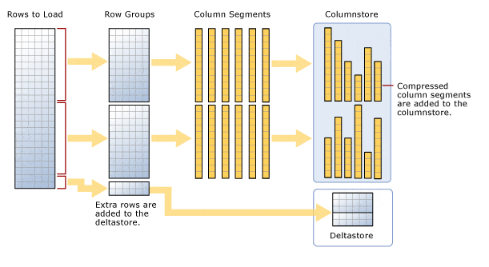

>## Columnstore index

S poločnosť Microsoft v rámci zvyšovania výkonnosti svojho DB servera s názvom SQL Server prichádza s novými funkciami. Patrí k nim aj funkcia **columnstore indexov**. Je to iný spôsob ukladania tabuliek, ktorý môže výrazne zlepšiť výkon pri určitých typov dotazov najmenej desaťkrát. Sú užitočné najmä s tabuľkami faktov a majú **použitie v dátových skladoch a veľkých tabuľkách**.

Columnstore jednoducho znamená **nový spôsob ukladania údajov do indexu**. Namiesto bežných indexov Rowstore alebo b-tree, kde sú údaje logicky a fyzicky usporiadané a uložené ako tabuľka s riadkami a stĺpcami, sú **údaje v indexoch columnstore fyzicky uložené v stĺpcoch a k tomu ešte logicky usporiadané do riadkov a stĺpcov**. Namiesto uloženia celého riadka alebo riadkov na stránku sa na stránku uloží jeden stĺpec z mnohých riadkov. Práve tento rozdiel v architektúre poskytuje indexu columnstore veľmi **vysokú úroveň kompresie** spolu so znížením úložného priestoru a poskytovaním masívnych zlepšení vo výkone čítania.

**Index funguje tak**, že údaje rozdelí na komprimovateľné segmenty. Vyžaduje skupinu riadkov, minimálne 102 400 riadkov s maximálnym počtom približne 1 milión riadkov, nazývaných skupina riadkov , a potom túto skupinu riadkov zmení na segmenty stĺpcov. Sú to tieto segmenty, ktoré sú základnou jednotkou úložiska pre index columnstore, ako je znázornené nižšie.

Predstavte si, že ide o tabuľku s 2,1 miliónmi riadkov a šiestimi stĺpcami. To znamená, že teraz existujú dve skupiny riadkov, každá po 1 048 576 riadkoch a zvyšok 2 848 riadkov, ktorý sa nazýva deltaskupina. Keďže každá skupina riadkov obsahuje minimálne 102 400 riadkov, delta skupina riadkov sa používa na uloženie všetkých zostávajúcich indexových záznamov, kým nebude mať dostatok riadkov na vytvorenie ďalšej skupiny riadkov. Môžete mať viacero delta skupín riadkov, ktoré čakajú na presun do columnstore. V delta sklade je uložených viacero delta skupín a je to vlastne index B-stromu, ktorý sa používa ako doplnok k columnstore. V ideálnom prípade bude mať váš index skupiny riadkov obsahujúce takmer 1 milión riadkov, aby sa znížila réžia operácií skenovania.

Teraz, aby sme veci skomplikovali ešte o krok ďalej, **existuje proces**, ktorý beží **na presun delta skupín riadkov** z delta úložiska **do indexu columnstore**, ktorý sa nazýva proces n-tice . Tento proces kontroluje uzavreté skupiny, čo znamená skupinu, ktorá má maximálne 1 milión záznamov a je pripravená na kompresiu a pridanie do indexu. Ako je znázornené na obrázku, index columnstore má teraz dve skupiny riadkov, ktoré potom rozdelí na segmenty stĺpcov pre každý stĺpec v tabuľke. Tým sa vytvorí šesť stĺpov s 1 miliónom riadkov na skupinu riadkov, čo predstavuje celkovo 12 segmentov stĺpcov. Dáva zmysel? Práve tieto segmenty stĺpcov sú komprimované jednotlivo na uloženie na disk. Motor berie tieto stĺpiky a používa ich na veľmi vysoko paralelné skenovanie údajov. Proces presunu n-tice môžete vynútiť aj vykonaním zmeny organizácie vo vašom indexe columnstore.

Na **uľahčenie rýchlejšieho prístupu k údajom** sú **v hlavičke stránky uložené iba hodnoty Min a Max pre skupinu riadkov**. Okrem toho spracovanie dotazov, čo sa týka ukladania stĺpcov, používa dávkový režim , ktorý umožňuje stroju spracovať viacero riadkov naraz. Vďaka tomu je motor schopný v niektorých prípadoch spracovať riadky extrémne rýchlo, čo poskytuje dvoj- až štvornásobný výkon v porovnaní s procesom jedného dotazu. Ak napríklad robíte agregáciu, stane sa to veľmi rýchlo, pretože do pamäte sa načíta iba agregovaný riadok a pomocou skupín riadkov môže nástroj dávkovo spracovať skupiny s 1 miliónom riadkov. V SQL Server 2019 sa dávkový režim zavedie aj do niektorých indexov ukladania riadkov a plánov vykonávania.

**Ďalším zaujímavým rozdielom** medzi indexmi columnstore a indexmi b-tree je, že **indexy columnstore nemajú kľúče**. Môžete tiež pridať všetky stĺpce nájdené v tabuľke, pokiaľ nie sú obmedzeným typom údajov, do indexu bez klastrov columnstore a neexistuje žiadna koncepcia zahrnutých stĺpcov . Toto je radikálne nový spôsob myslenia, ak ste zvyknutí ladiť tradičné indexy.

Zápis scriptu s columnstore indexom pre vytvorenie tabuľky *products* najdeme atribút COLUMNSTORE INDEX :

~~~
CREATE TABLE products(ID [int] NOT NULL, OrderDate [int] NOT NULL, ShipDate [int] NOT NULL);
GO

CREATE CLUSTERED COLUMNSTORE INDEX cci_T1 ON products;
GO
~~~

Podrobnejšie informácie ohľadom Columnstore indexov s príkladmi a porovnaním s klasickými indexami najdeme [**tu**](https://www.red-gate.com/simple-talk/databases/sql-server/t-sql-programming-sql-server/what-are-columnstore-indexes/) a na str=ank=ach [Microsoftu](https://learn.microsoft.com/en-us/sql/relational-databases/indexes/columnstore-indexes-overview?view=sql-server-2017).

Problematika Columnstore indexov je výsostnou doménou DB serverov spoločnosti Microsoft a v iných serverov či databázach (napr. SQLite) nie je podporovaná. Aj tu však existujú riešenia kde sa táto technológia uplatňuje. Tak napr. edícia postgresql s názvom *citus*, umožňuje vytvárať postgresql s indexmi columnstore. Citus je distribuovaná/klastrovaná databáza ale môžete vytvoriť iba jednu databázu na inštanciu, takže toto riešenie má obmedzenie. Existuje aj cloudovo spravovaná inštancia s názvom *Azure Cosmos DB** pre PostgreSQL. Viac o úvod do indexov ColumnStore PostgreSQL je uvedené v tomto [videu](https://postgresconf.org/conferences/postgres-webinar-series/program/proposals/introduction-to-postgresql-columnstore-indexes). Každý iný DBS je preto potrebné skúmať individuálne či túto technológiu podporuje a akým spôsobom. 

Otázky k téme:

1./ Kto je tvorcom technológie columnstore indexu a na aký DB Server bola vytvorená
2./ V čom spočíva princíp technológie columstore indexovania
3./ Kedy s atechnológia columnstore indexovania používa a aké má prednosti
