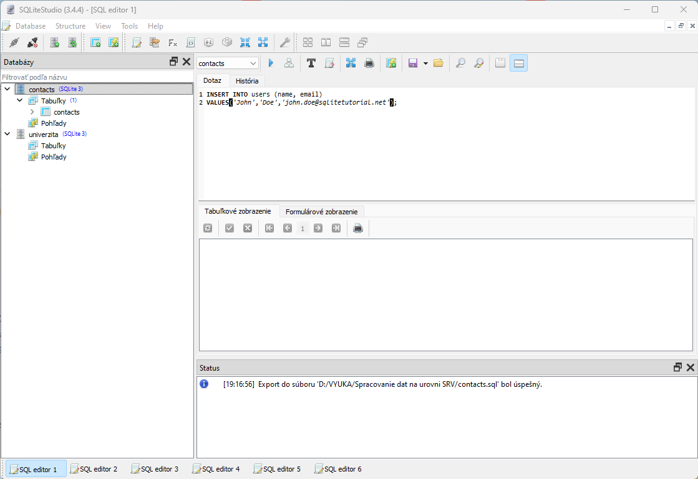
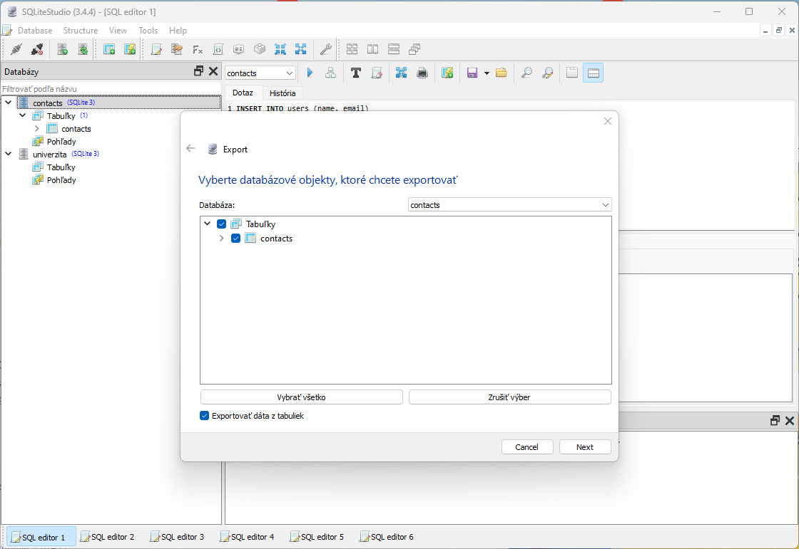
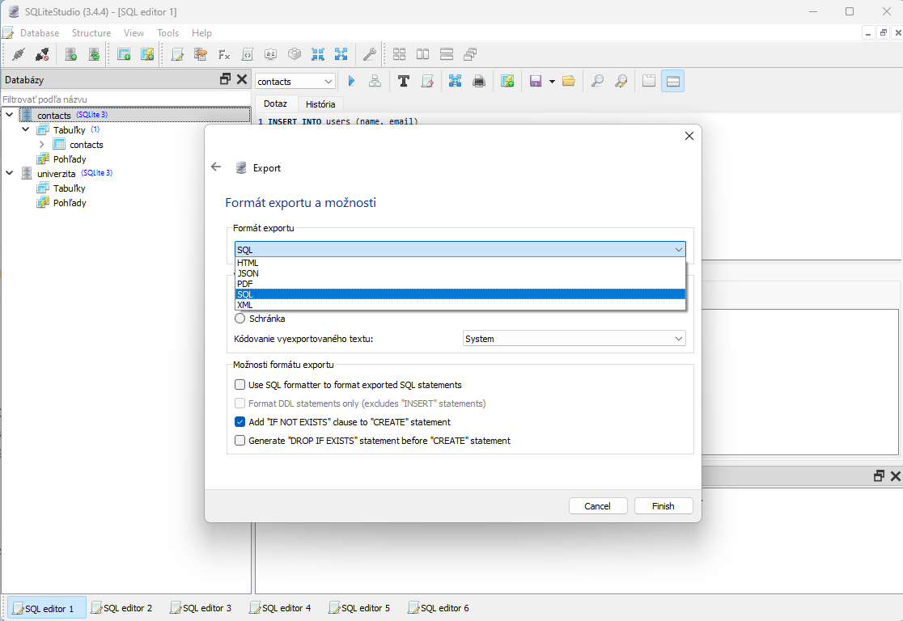
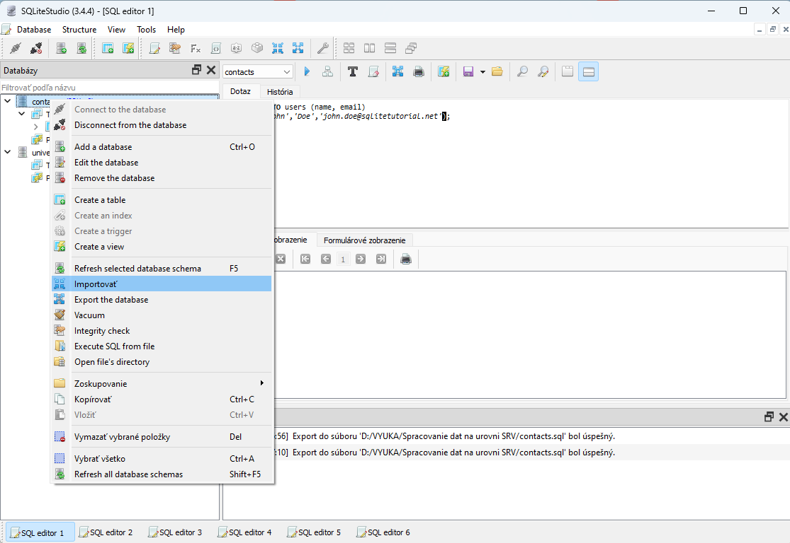
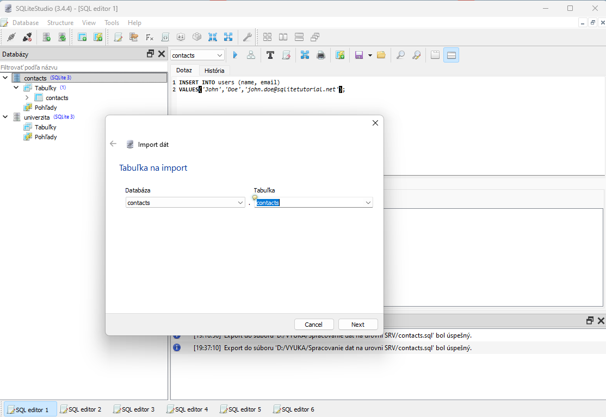
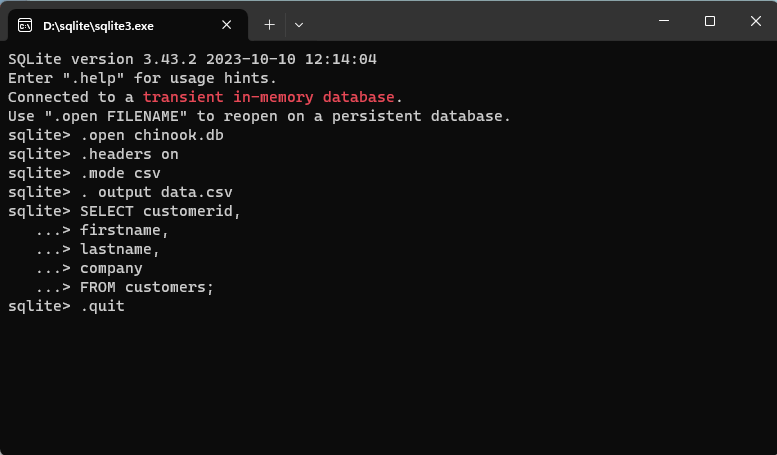
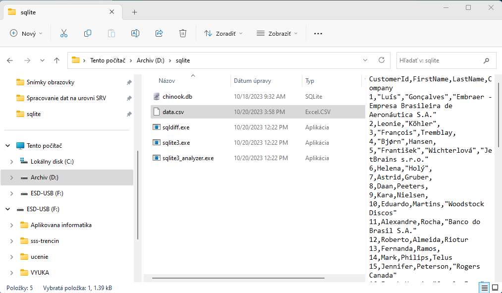
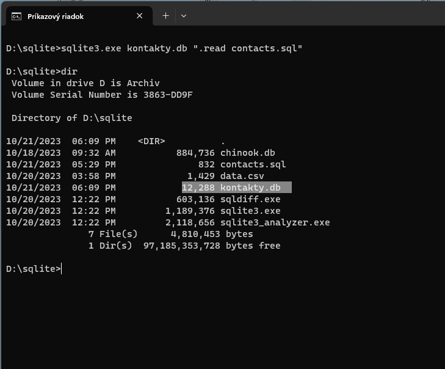
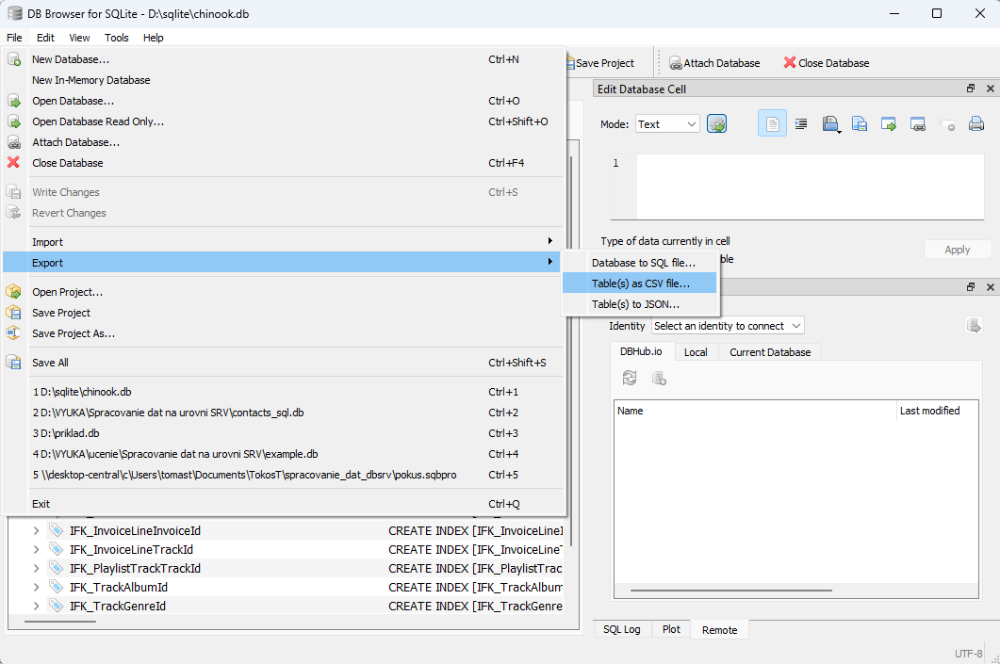

>## Zalohovanie a obnovovanie databázy

Zálohovanie a obnovovanie databázy sa môže uskutočňovať dvomi spôsobmi:\
1./ Použitím GUI prostredia menežovacieho SW príslušného DBS (napr. SQLite, SQLite STudio či pgAdmin od PostgreSQL a pod.) alebo\
2./ Použitím CLI príkazu príslušného DBS v terminalovom okne.

Vzhľadom že prvá metóda je komfortnejšia a nevyžaduje inštaláciu DBS pre použitie v terminálovom okne budeme viac pozornosti venovať práve jej.

### Zálohovanie a obnova pomocou GUI prostredia SQLite Studio

>### Zálohovanie databazy do SQL súboru

Pri zálohovaní databázy sa spravidla vztvára SQL súbor, ktorý má priponu .sql.
Ďalšou možnosťou j eurobiť export do iného formátu ktorým je spravidla .cvs ktorý je napr čitatelný aj v programe Exel resp. v príkazoch programovacieho jazyka Python.

Postup pri SQLite Studio:\
1./ V zozname existujúcich databáz vyberieme a označíme tú ktorú chceme zálohovať (napr. *contacts*)\
2./ V menu ktorá sa nám objaví pokliknutí na pravú myš si vyberieme položku *Export the database*

3./ V naslednom okne vyberieme všetko a pokračujeme stlačním *Next*

4./ Ako formát exportu vyberieme SQL resp. iny z ponuky a ev. nastávíme ciel uloženia či iné parametre:

5./ Nakoniec stlačím etlačítko *Finish*

Podobným postupom vieme v kroku 4./ vybrat ako výstupný formát súboru aj ine možnosti ako JSON, XML, HTML a PDF. Žiaľ format CSV sa tu nenachádza a tak pri obnove z formátu .sql budeme musie pri tomto nástroji použiť CLI

>### Obnova databázy z CSV súboru

Pokial budeme obnovovať našu databázu pomocou SQLite Studio, tak z ponuky si vieme ako vstupný súbor vybrať iba súbor s formátom .csv ktorý sm enapr dostali z Excelu. Pre ine formáty budeme musieť použiť pri SQLite Studio CLI príkazy.

Pri obnove databázy z CSV postupujeme obdobne ako to bolo pri exporte vyšsie:
1./ Vyberieme *Importovať*
2./ Nasledne v okne pre Import vyberieme databazu a jej tabuľky. Stlačíme *Next*
3./ Vyberieme csv súbor z adresára a stlačíme *Next*

### Zálohovanie a obnova pomocou CLI príkazov prostredia SQLite Studio

>### Zálohovanie databazy do CSV súboru pomocou príkazov SQlite

Ak sa rozhodnete uskutočniť zálohovanie resp. export iba tabuľky (nedá sa celá databáza) tak to môžeme urobiť pomocou nástroja sqlite3 použiťím príkazv SQL a bodkových príkazov na interakciu s databázou SQLite. Postup je nasledovný:

1./ Vytvoríme hlavičku vysledného súboru pomocou príkazu *.header*.\
2./ Nastavíme výstupný režim na CSV, aby sme dali nástroju sqlite3 pokyn, že  výsledok bude vo formáte CSV.
3./ Výstup odošlemedo súboru CSV.
4./ Zadáme dotaz na výber údajov z tabuľky, do ktorej chcete exportovať.

Nasledovné príkazy vyberú údaje z  *customers* a exportujú ich ako data.súboru csv. Predtým však musíme dvojklikom ľavej myši spustiť SW sqlite3.exe ktorý otvorí terminálové okno. V tom istom adresári by sa mala nachádzať aj databáza chinook.db ktorá obsahuje tabuľku customers. Sqlive3.exe sa nám ohlási promptom >sqlite ktorému budeme zadávať tieto príkazy ukončene Enter-om:
~~~
sqlite> .open chinook.db
sqlite> .headers on
sqlite> .mode csv
sqlite> .output data.csv
sqlite> SELECT customerid,
   ...> firstname,
   ...> lastname,
   ...> company
   ...> FROM customers;
sqlite> .quit
~~~
Zápis v terminálovom okne sqlite3:

Do adresára D:/sqlite pribudol nový súbor *data.csv* ktorý si môžeme pozrieť napr. v Excely"

>### Obnova databazy zo súboru sql pomocou príkazov SQlite

Ako naimportujem súbor contacts.sql pomocou CLI do SQLite aby sa automaticky vytvoril ? Snáď najjednoduchšie je to urobiť v terminálovom okne Microsoftu ktoré si vzhľadáme cez skratku CMD. Následne sa pomocou príkazov **dir** (samotne dir nám ukáže kde sme a keď za neho zadáme názov priečinka kam chceme ísť, tak sa tam presunieme) presunieme do priečinka kde máme sqlite3.exe a náš subor.sql, ktory chceme pretransformovať na formát s príponou .db Riešenie je iba jeden nasledovný príkaz:
~~~
sqlite3.exe kontakty.db ".read contacts.sql"
~~~
Zo súboru contacts.sql sme si vytvorili nový súbor kontakty.db ktorý vieme načitať do SQLite Studia a tam ho spracovávať.

>#### Všetky príkazy ktoré možno použiť pre sqlite3.exe pomocou CLI nájdeme [**tu**](https://www.tutorialspoint.com/sqlite/sqlite_commands.htm)

>### Obnova databázy z SQL súboru pomocou SW s GUI

Na tieto úkony však môžeme použiť GUI nástroj **DB Browser (SQLite)** ktorý nám ponúka funkcie Export a Import. 

Postup zálohovania (exportu) a obnovy (importu) je podobný ako tomu bolo v prípade použitia SW SQLite Studio. 

Rozdiel je iba v tom že pri exporte dostaneme aj ponuku na vytvorenie súboru vo formáte .csv a pri importe ponuku na načítanie súboru vo formáte .sql. Tento nástroj nám však neponúka prácu s inými formátmi súborov kedy musíme využit DB Browse alebo nejaký iný nástroj.

