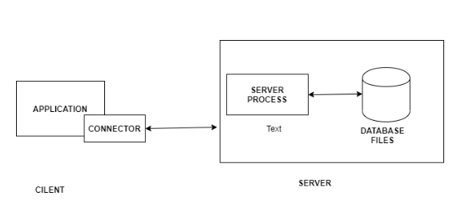
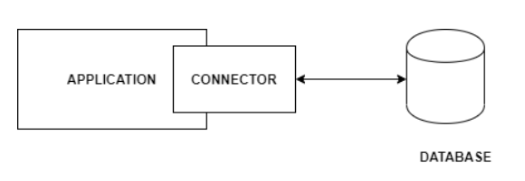
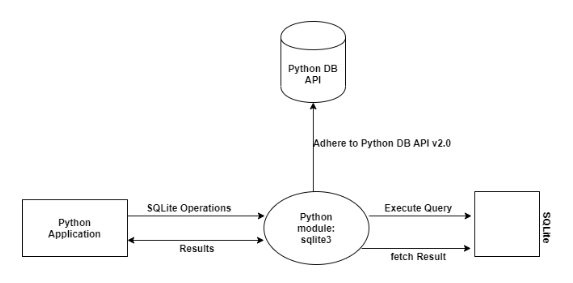
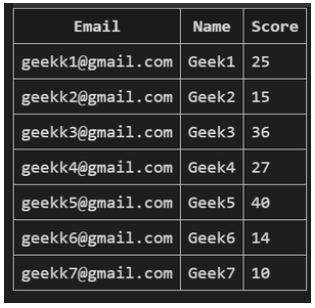

Úvod do SQLite v Pythone

https://www.geeksforgeeks.org/introduction-to-sqlite-in-python/?ref=lbp

Databázy ponúkajú množstvo funkcií, pomocou ktorých je možné jednoducho spravovať veľké množstvo informácií cez web a veľkoobjemový vstup a výstup údajov cez typický súbor, ako je textový súbor. SQL je dopytovací jazyk a je veľmi populárny v databázach. Mnoho webových stránok používa MySQL. SQLite je „ľahká“ verzia, ktorá funguje so syntaxou veľmi podobnou SQL. SQLite je samostatný, vysoko spoľahlivý, vstavaný, plne funkčný, verejný databázový stroj SQL. Je to najpoužívanejší databázový nástroj na celosvetovej sieti. Python má knižnicu na prístup k databázam SQLite, nazývanú sqlite3, určenú na prácu s touto databázou, ktorá je súčasťou balíka Python od verzie 2.5. SQLite má nasledujúce funkcie.

Bez servera
Samostatný
Nulová konfigurácia
Transakčný
Single-database
Bez servera
Vo všeobecnosti RDBMS, ako je MySQL, PostgreSQL atď., potrebuje na svoju činnosť samostatný serverový proces. Aplikácie, ktoré chcú pristupovať k databázovému serveru, používajú protokol TCP/IP na odosielanie a prijímanie požiadaviek a nazýva sa to architektúra klient/server.

SQLite na spustenie nevyžaduje server. SQLite databáza je spojená s aplikáciou, ktorá pristupuje k databáze. Databáza SQLite číta a zapisuje priamo z databázových súborov uložených na disku a aplikácie interagujú s touto databázou SQLite.

Samostatný
SQLite je samostatný, čo znamená, že nepotrebuje žiadne externé závislosti, ako je operačný systém alebo externá knižnica. Táto funkcia SQLite pomáha najmä vo vstavaných zariadeniach, ako sú iPhone, telefóny s Androidom, herné konzoly, vreckové prehrávače médií atď. SQLite je vyvinutý pomocou ANSI-C. Zdrojový kód je dostupný ako veľký sqlite3.c a jeho hlavičkový súbor sqlite3.h. Ak chcú používatelia vyvinúť aplikáciu, ktorá používa SQLite, používatelia jednoducho musia vložiť tieto súbory do vášho projektu a skompilovať ho s vaším kódom.

Nulová konfigurácia
SQLite má nulovú konfiguráciu, čo znamená, že nie je potrebné žiadne nastavenie ani správa. Vďaka architektúre bez servera nemusíte SQLite pred použitím „inštalovať“. Neexistuje žiadny serverový proces, ktorý by bolo potrebné nakonfigurovať, spustiť a zastaviť.

Transakčný
SQLite je transakčný znamená, že sú atómové, konzistentné, izolované a odolné (ACID). Všetky transakcie v SQLite sú plne kompatibilné s ACID. Inými slovami, všetky zmeny v rámci transakcie sa uskutočnia úplne alebo vôbec, aj keď dôjde k neočakávanej situácii, ako je zlyhanie aplikácie, výpadok napájania alebo zlyhanie operačného systému.

Single-database
SQLite je jediná databáza, čo znamená, že umožňuje jednému pripojeniu k databáze pristupovať k viacerým databázovým súborom súčasne. Tieto funkcie prinášajú mnoho príjemných funkcií, ako je spájanie tabuliek v rôznych databázach alebo kopírovanie údajov medzi databázami v jednom príkaze. SQLite tiež používa dynamické typy pre tabuľky. Znamená to, že do ľubovoľného stĺpca môžete uložiť akúkoľvek hodnotu bez ohľadu na typ údajov.

Pochopenie práce s modulom SQLite v Pythone

Python SQLite sa používa na demonštráciu toho, ako vyvíjať databázové aplikácie Python s databázou SQLite. Dozviete sa, ako vykonávať operácie s databázou SQLite z Pythonu. SQLite je zabudovaný do väčšiny počítačov a mobilných zariadení a prehliadačov. Oficiálny modul Pythonu sqlite3 nám pomáha pracovať s databázou SQLite.

V tomto diagrame modul Python sqlite3 dodržiava špecifikáciu API databázy Python v2.0 (PEP 249). PEP 249 poskytuje rozhranie SQL, ktoré bolo navrhnuté tak, aby podporovalo a udržiavalo podobnosť medzi modulmi Pythonu, ktoré sa používajú na prístup k databázam.

Python SQLite – Pripojenie k databáze

V tomto článku budeme diskutovať o tom, ako sa pripojiť k databáze SQLite pomocou modulu sqlite3 v Pythone.

Pripojenie k databáze

Pripojenie k databáze SQLite je možné vytvoriť pomocou metódy **connect()** a odovzdať ako parameter názov databázy, ku ktorej sa má pristupovať. Ak táto databáza neexistuje, bude vytvorená. 
~~~
sqliteConnection = sqlite3.connect('sql.db')
~~~

Ale čo ak chcete po vytvorení pripojenia vykonať nejaké dotazy. Na to je potrebné na inštancii pripojenia vytvoriť kurzor pomocou metódy **cursor()**. Ten vykoná naše SQL dotazy.
~~~
curzor = sqliteConnection.cursor()
print('DB Init')
~~~

SQL dotaz, ktorý sa má vykonať, môže byť napísaný vo forme reťazca a potom vykonaný volaním metódy **execute()** na objekt kurzora. Potom je možné výsledok načítať zo servera pomocou metódy **fetchall()** , čo je v tomto prípade číslo verzie SQLite.
~~~
query = 'SQL query;'
cursor.execute(query)
result = cursor.fetchall()
print('SQLite Version is {}'.format(result))
~~~

V nižšie uvedenom príklade ktorý zapíšeme do súboru main.py, kde sa pripojíme k databáze SQLite a spustíme jednoduchý dotaz select sqlite_version(); nájsť verziu SQLite, ktorú používame.
~~~
import sqlite3

try:

	# Connect to DB and create a cursor
	sqliteConnection = sqlite3.connect('sql.db')
	cursor = sqliteConnection.cursor()
	print('DB Init')

	# Write a query and execute it with cursor
	query = 'select sqlite_version();'
	cursor.execute(query)

	# Fetch and output result
	result = cursor.fetchall()
	print('SQLite Version is {}'.format(result))

	# Close the cursor
	cursor.close()

# Handle errors
except sqlite3.Error as error:
	print('Error occurred - ', error)

# Close DB Connection irrespective of success
# or failure
finally:

	if sqliteConnection:
		sqliteConnection.close()
		print('SQLite Connection closed')

~~~
Po spustení príkazom $ python main.py bude výsledkom toto: 
~~~
DB Init
SQLite Version is [('3.21.0',)]
SQLite Connection closed
~~~

## Dátové typy SQLite a jeho zodpovedajúce typy Pythonu

https://www.geeksforgeeks.org/sqlite-datatypes-and-its-corresponding-python-types/?ref=lbp

SQLite je knižnica vytvorená s jazykom C, ktorá poskytuje prenosný a bezserverový databázový stroj SQL . Má súborovú architektúru; teda číta a zapisuje na disk. Keďže SQLite je databáza s nulovou konfiguráciou, pred jej použitím nie je potrebná žiadna inštalácia ani nastavenie. Od Pythonu 2.5.x je SQLite3 štandardne dodávaný s pythonom.

V tomto článku budeme diskutovať o [dátových typoch SQLite](https://www.geeksforgeeks.org/sqlite-data-types/) a ich  dátových typoch zodpovedajúcich Pythonu

### Trieda úložiska v SQLite
Triedu úložiska možno nazvať kolekciou podobných údajových typov. SQLite poskytuje nasledujúce triedy úložiska:

| Storage Class    | Uložená hodnota                                                                     |
|-----------|---------------------------------------------------------------------------|
| NULL | NULL
|INTEGER| Celé číslo so znamienkom (1, 2, 3, 4, 5 alebo 8 bajtov v závislosti od veľkosti)
|REAL|Hodnota s pohyblivou rádovou čiarkou (8 bajtové čísla s pohyblivou rádovou čiarkou IEEE)
|TEXT| TEXTový reťazec (zakódovaný v UTF-8, UTF-16BE alebo UTF-16LE
|BLOB (Binary Large Object)| Dáta sú uložené presne tak, ako boli zadané, zvyčajne v binárnom formáte
|

Termín **Storage Class** sa môže stotožňovať s významom pojmu **DataType** čiže Datový typ.

### Zodpovedajúce dátové typy Pythonu
Dátové typy SQLite a ich zodpovedajúce typy Pythonu sú nasledovné

| Storage Class    | Dátový typ Pythonu                                                                     |
|-----------|---------------------------------------------------------------------------|
| NULL | None
|INTEGER| int
|REAL|float
|TEXT| str
|BLOB| bytes
|

Funkciu type() možno v pythone použiť na získanie triedy argumentu. V programe nižšie sa funkcia type() používa na tlač tried každej hodnoty, ktorú ukladáme do databázy.

Zoberme si príklad DBdata_type.py, v ktorom vytvárame databázu s názvom 'gfg' a potom vytvoríme tabuľku s názvom exam_hall s niekoľkými stĺpcami, ktoré sú nasledovné:

1. NAME (TEXT),
2. PIN (INTEGER),
3. OCCUPANCY (REAL),
4. LOGO (BLOB).

Potom do nej vložíme niekoľko riadkov a skontrolujeme dátové typy hodnôt načítaných pomocou SQL dotazov v Pythone.

~~~
# Python3 program to demonstrate SQLite3 datatypes 
# and corresponding Python3 types 

# import the sqlite3 package 
import sqlite3 

# create connection to database 
cnt = sqlite3.connect('gfg.db') 

# Create a exam_hall relation 
cnt.execute('''CREATE TABLE exam_hall( 
NAME TEXT, 
PIN INTEGER, 
OCCUPANCY REAL, 
LOGO BLOB);''') 

# Open the logo file in read, binary mode 
# read the image as binary data into a variable 
fileh = open('/content/JSBinCollaborativeJavaScriptDebugging6-300x160.png', 'rb') 
img = fileh.read() 

# Insert tuples for the relation 
cnt.execute('''INSERT INTO exam_hall VALUES( 
'centre-a',1125,98.6,?)''', (img,)) 
cnt.execute('''INSERT INTO exam_hall VALUES( 
NULL,1158,80.5,?)''', (img,)) 

# Query the data, print the data and its type 
# note: Printing the image binary data is impractical due to its huge size 
# instead number of bytes are being printed using len() 
cursor = cnt.execute('''SELECT * FROM exam_hall;''') 
for i in cursor: 
	print(str(i[0])+" "+str(i[1])+" "+str(i[2])+" "+str(len(i[3]))) 
	print(str(type(i[0]))+" "+str(type(i[1]))+" " +
		str(type(i[2]))+" "+str(type(i[3]))+"\n") 

~~~

Výsledok bude :
~~~
centre-a 1125 98.6 26005
<class 'str'> <class 'int'> <class 'float'> <class 'bytes'>

None 1158 80.5 26005
<class 'NoneType'> <class 'int'> <class 'float'> <class 'bytes'>
~~~

Z výstupu tohto programu možno urobiť nasledujúce závery:

1. 'centre-a', ktoré bolo vložené ako TEXT , interpretoval python ako str
2. 1125, 1158, ktoré boli vložené ako INTEGER , boli interpretované pythonom ako int
3. 98.6, 80.5, ktoré boli vložené ako REAL , boli interpretované pythonom ako float
4. NULL bol interpretovaný pythonom ako NoneType
5. Obrázok loga, ktorý bol vložený v binárnom formáte ako BLOB , bol interpretovaný pythonom ako bajty.

## Python SQLite – objekt kurzora

https://www.geeksforgeeks.org/python-sqlite-cursor-object/?ref=lbp

V tomto článku budeme diskutovať o objektoch kurzora v module sqlite3 Pythonu.

### Objekt kurzora

Je to objekt, ktorý sa používa na vytvorenie spojenia pri vykonávaní SQL dotazov. Funguje ako middleware medzi SQLite databázovým pripojením a SQL dotazom. Vytvára sa po pripojení k databáze SQLite.
~~~
Syntax: naov_kurzora_objectu=nazov_objektu_pripojenia.execute(“dotaz sql”);
~~~

Príklad data.py: Python kód na vytvorenie databázy hotelových údajov a vloženie záznamov do hotelovej tabuľky.

~~~
# importing sqlite3 module
import sqlite3

# create connection by using object
# to connect with hotel_data database
connection = sqlite3.connect('hotel_data.db')

# query to create a table named FOOD1
connection.execute(''' CREATE TABLE hotel
		(FIND INT PRIMARY KEY	 NOT NULL,
		FNAME		 TEXT NOT NULL,
		COST		 INT	 NOT NULL,
		WEIGHT	 INT);
		''')

# insert query to insert food details in 
# the above table
connection.execute("INSERT INTO hotel VALUES (1, 'cakes',800,10 )")
connection.execute("INSERT INTO hotel VALUES (2, 'biscuits',100,20 )")
connection.execute("INSERT INTO hotel VALUES (3, 'chocos',1000,30 )")

print("All data in food table\n")

# create a cousor object for select query
cursor = connection.execute("SELECT * from hotel ")

# display all data from hotel table
for row in cursor:
	print(row)

~~~

Príklad data01.py: Python kód na zobrazenie údajov z hotelovej tabuľky.
~~~
# importing sqlite3 module
import sqlite3

# create connection by using object
# to connect with hotel_data database
connection = sqlite3.connect('hotel_data.db')

# insert query to insert food details 
# in the above table
connection.execute("INSERT INTO hotel VALUES (1, 'cakes',800,10 )");
connection.execute("INSERT INTO hotel VALUES (2, 'biscuits',100,20 )");
connection.execute("INSERT INTO hotel VALUES (3, 'chocos',1000,30 )");

print("Food id and Food Name\n")

# create a cousor object for select query
cursor = connection.execute("SELECT FIND,FNAME from hotel ")

# display all data from FOOD1 table
for row in cursor:
	print(row)

~~~

### Python SQLite – Vytvorenie tabuľky

V tomto článku budeme diskutovať o tom, ako môžeme vytvárať tabuľky v databáze SQLite z programu Python pomocou modulu sqlite3. 

V databáze SQLite používame na vytvorenie tabuľky nasledujúcu syntax:
~~~
CREATE TABLE názov_databázy.názov_tabuľky(stĺpec1 údajový typ PRIMARY KEY (jeden alebo viac stĺpcov),  
typ údajov stĺpec2,
typ údajov stĺpec3,

…

typ údajov stĺpecN
);
~~~

Teraz vytvoríme tabuľku pomocou Pythonu:

Prístup:

Importujte požadovaný modul

* Vytvoríme spojenie alebo vytvoríme objekt spojenia s databázou pomocou funkcie connect() modulu sqlite3.
* Vytvoríme objekt Cursor volaním metódy cursor() objektu Connection.
* Tabuľka formulárov pomocou príkazu CREATE TABLE s metódou execute() triedy Cursor.
Implementácia bude uložená do súboru tabe01.py:
~~~
import sqlite3

# Connecting to sqlite
# connection object
connection_obj = sqlite3.connect('geek.db')

# cursor object
cursor_obj = connection_obj.cursor()

# Drop the GEEK table if already exists.
cursor_obj.execute("DROP TABLE IF EXISTS GEEK")

# Creating table
table = """ CREATE TABLE GEEK (
			Email VARCHAR(255) NOT NULL,
			First_Name CHAR(25) NOT NULL,
			Last_Name CHAR(25),
			Score INT
		); """

cursor_obj.execute(table)

print("Table is Ready")

# Close the connection
connection_obj.close()

~~~

### Python SQLite – Vloženie údajov

V tomto článku budeme diskutovať o tom, ako môžeme vložiť údaje do tabuľky v databáze SQLite z Pythonu pomocou modulu sqlite3.  Príkaz SQL INSERT INTO SQL sa používa na vloženie nového riadku do tabuľky. Existujú dva spôsoby použitia príkazu INSERT INTO na vkladanie riadkov:

* Iba hodnoty : Prvým spôsobom je zadať iba hodnotu údajov, ktoré sa majú vložiť, bez názvov stĺpcov.
~~~
NSERT INTO table_name VALUES (hodnota1, hodnota2, hodnota3,…);

table_name: názov tabuľky.

hodnota1, hodnota2,.. : hodnota prvého stĺpca, druhého stĺpca,... pre nový záznam
~~~

* Názvy stĺpcov aj hodnoty: V druhej metóde určíme stĺpce, ktoré chceme vyplniť, a ich zodpovedajúce hodnoty, ako je uvedené nižšie:
~~~
INSERT INTO názov_tabuľky (stĺpec1, stĺpec2, stĺpec3,..) HODNOTY (hodnota1, hodnota2, hodnota3,..);

table_name: názov tabuľky.

stĺpec 1: názov prvého stĺpca, druhého stĺpca …

hodnota1, hodnota2, hodnota3 : hodnota prvého stĺpca, druhého stĺpca,... pre nový záznam
~~~

Príklad bude uložený do súboru insert03.py a zobrazuje, ako vložiť údaje do tabuľky SQLite iba pomocou hodnôt. V programe si najskôr vytvoríme tabuľku s názvom STUDENT a následne do nej vložíme hodnoty pomocou 1. syntaxe dotazu INSERT. Nakoniec zobrazíme obsah tabuľky a odošleme ju do databázy.
~~~
# Import module 
import sqlite3 

# Connecting to sqlite 
conn = sqlite3.connect('geeks2.db') 

# Creating a cursor object using the 
# cursor() method 
cursor = conn.cursor() 

# Creating table 
table ="""CREATE TABLE STUDENT(NAME VARCHAR(255), CLASS VARCHAR(255), 
SECTION VARCHAR(255));"""
cursor.execute(table) 

# Queries to INSERT records. 
cursor.execute('''INSERT INTO STUDENT VALUES ('Raju', '7th', 'A')''') 
cursor.execute('''INSERT INTO STUDENT VALUES ('Shyam', '8th', 'B')''') 
cursor.execute('''INSERT INTO STUDENT VALUES ('Baburao', '9th', 'C')''') 

# Display data inserted 
print("Data Inserted in the table: ") 
data=cursor.execute('''SELECT * FROM STUDENT''') 
for row in data: 
	print(row) 

# Commit your changes in the database	 
conn.commit() 

# Closing the connection 
conn.close()

~~~

Príklad bude uložený do súboru insert04.py je podobný programu 1. programu, ale hodnoty vložíme do tabuľky tak, že zmeníme poradie názvov stĺpcov s hodnotami ako v 2. syntaxi.

### Python SQLite – Výber údajov z tabuľky

V tomto článku budeme diskutovať o vybranom príkaze modulu Python SQLite. Tento príkaz sa používa na získanie údajov z tabuľky SQLite a vráti údaje obsiahnuté v tabuľke.

V SQLite je syntax príkazu Select Statement:
~~~
SELECT * FROM názov_tabuľky;

* : znamená celý stĺpec z tabuľky

Ak chcete vybrať konkrétny stĺpec, nahraďte * názvom stĺpca alebo názvami stĺpcov.
~~~

Náše programy umiestníme v súboroch read01.py až read04.py a použijeme pri tom príkaz Select aby sme mohli vidieť obsahy nasledovnej tabuľky :

### Vytvorenie tabuľky v databáze geek1.db - read01.py
~~~
import sqlite3 

# Connecting to sqlite 
# connection object 
connection_obj = sqlite3.connect('geek.db') 

# cursor object 
cursor_obj = connection_obj.cursor() 

connection_obj.execute("""CREATE TABLE GEEK( 
Email varchar(255), 
Name varchar(50), 
Score int 
);""") 

connection_obj.execute( 
	"""INSERT INTO GEEK (Email,Name,Score) VALUES ("geekk1@gmail.com","Geek1",25)""") 
connection_obj.execute( 
	"""INSERT INTO GEEK (Email,Name,Score) VALUES ("geekk2@gmail.com","Geek2",15)""") 
connection_obj.execute( 
	"""INSERT INTO GEEK (Email,Name,Score) VALUES ("geekk3@gmail.com","Geek3",36)""") 
connection_obj.execute( 
	"""INSERT INTO GEEK (Email,Name,Score) VALUES ("geekk4@gmail.com","Geek4",27)""") 
connection_obj.execute( 
	"""INSERT INTO GEEK (Email,Name,Score) VALUES ("geekk5@gmail.com","Geek5",40)""") 
connection_obj.execute( 
	"""INSERT INTO GEEK (Email,Name,Score) VALUES ("geekk6@gmail.com","Geek6",36)""") 
connection_obj.execute( 
	"""INSERT INTO GEEK (Email,Name,Score) VALUES ("geekk7@gmail.com","Geek7",27)""") 

connection_obj.commit() 

# Close the connection 
connection_obj.close() 
import sqlite3 

# Connecting to sqlite 
# connection object 
connection_obj = sqlite3.connect('geek.db') 

# cursor object 
cursor_obj = connection_obj.cursor() 

connection_obj.execute("""CREATE TABLE GEEK( 
Email varchar(255), 
Name varchar(50), 
Score int 
);""") 

connection_obj.execute( 
	"""INSERT INTO GEEK (Email,Name,Score) VALUES ("geekk1@gmail.com","Geek1",25)""") 
connection_obj.execute( 
	"""INSERT INTO GEEK (Email,Name,Score) VALUES ("geekk2@gmail.com","Geek2",15)""") 
connection_obj.execute( 
	"""INSERT INTO GEEK (Email,Name,Score) VALUES ("geekk3@gmail.com","Geek3",36)""") 
connection_obj.execute( 
	"""INSERT INTO GEEK (Email,Name,Score) VALUES ("geekk4@gmail.com","Geek4",27)""") 
connection_obj.execute( 
	"""INSERT INTO GEEK (Email,Name,Score) VALUES ("geekk5@gmail.com","Geek5",40)""") 
connection_obj.execute( 
	"""INSERT INTO GEEK (Email,Name,Score) VALUES ("geekk6@gmail.com","Geek6",36)""") 
connection_obj.execute( 
	"""INSERT INTO GEEK (Email,Name,Score) VALUES ("geekk7@gmail.com","Geek7",27)""") 

connection_obj.commit() 

# Close the connection 
connection_obj.close() 

~~~

### Prečítajte si všetky riadky - read02.py:
Teraz použijeme príkaz Select na načítanie údajov z tabuľky a načítanie všetkých záznamov. Na získanie všetkých záznamov použijeme metódu fetchall().
~~~
Syntax: kurzor.fetchall()

kde kurzor je objekt spojenia sqlite3 s databázou.
~~~

~~~
import sqlite3 

# Connecting to sqlite 
# connection object 
connection_obj = sqlite3.connect('geek.db') 

# cursor object 
cursor_obj = connection_obj.cursor() 

# to select all column we will use 
statement = '''SELECT * FROM GEEK'''

cursor_obj.execute(statement) 

print("All the data") 
output = cursor_obj.fetchall() 
for row in output: 
print(row) 

connection_obj.commit() 

# Close the connection 
connection_obj.close()

~~~

### Prečítajte si niektoré riadky - read03.py:

Teraz použijeme príkaz Select na získanie údajov z tabuľky a načítanie mnohých záznamov, nie všetkých. Na načítanie mnohých záznamov použijeme metódu fetchmany().
~~~
Syntax: kurzor.fetchmany(veľkosť)

Parametre: veľkosť – limit pre načítanie záznamov

kde kurzor je objekt spojenia sqlite3 s databázou.
~~~

~~~
import sqlite3 

# Connecting to sqlite 
# connection object 
connection_obj = sqlite3.connect('geek.db') 

# cursor object 
cursor_obj = connection_obj.cursor() 

# to select all column we will use 
statement = '''SELECT * FROM GEEK'''

cursor_obj.execute(statement) 

print("Limited data") 
output = cursor_obj.fetchmany(5) 
for row in output: 
print(row) 

connection_obj.commit() 

# Close the connection 
connection_obj.close() 

~~~

### Čítať iba jeden riadok - read04.py:
Teraz e použije príkaz Select na získanie údajov z tabuľky a načítanie iba jedného záznamu. Na načítanie iba jedného záznamu použijeme metódu fetchone().
~~~
Syntax: kurzor.fetchone()

kde kurzor je objekt spojenia sqlite3 s databázou.
~~~

~~~
import sqlite3 

# Connecting to sqlite 
# connection object 
connection_obj = sqlite3.connect('geek.db') 

# cursor object 
cursor_obj = connection_obj.cursor() 

# to select all column we will use 
statement = '''SELECT * FROM GEEK'''

cursor_obj.execute(statement) 

print("Only one data") 
output = cursor_obj.fetchone() 
print(output) 

connection_obj.commit() 

# Close the connection 
connection_obj.close() 

~~~

Príklady rôzneho spôsobu výberu najdeme na príslušných stránkách :
* [WHERE](https://www.geeksforgeeks.org/python-sqlite-where-clause/?ref=lbp) klauzula na spresnenie výsledkov vyhľadávania, kedy môžeme stanoviť špecifické podmienky, ktoré musia byť splnené pri získavaní údajov z databázy.
* [ORDER BY](https://www.geeksforgeeks.org/python-sqlite-order-by-clause/) príkaz SQL, ktorý sa používa na zoradenie údajov vzostupne alebo zostupne podľa jedného alebo viacerých stĺpcov. V predvolenom nastavení ORDER BY zoraďuje údaje vzostupne.
	* DESC sa používa na zoradenie údajov v zostupnom poradí.
    * ASC na zoradenie vo vzostupnom poradí.
* [LIMIT](https://www.geeksforgeeks.org/python-sqlite-limit-clause/?ref=lbp) Kľúčové slovo LIMIT sa používa na obmedzenie údajov zadaných príkazom SELECT.
* [JOIN](https://www.geeksforgeeks.org/python-sqlite-join-clause/) kombinuje záznamy z dvoch tabuliek na základe spoločných atribútov. Typy spojení sú nasledovné:

    * INNER JOIN (OR JOIN) – Poskytuje záznamy, ktoré majú spoločné atribúty v oboch tabuľkách.
	* LEFT JOIN – Poskytuje všetky záznamy z ľavej tabuľky a iba bežné záznamy z pravej tabuľky.
	* RIGHT JOIN – Poskytuje všetky záznamy z pravej tabuľky a iba bežné záznamy z ľavej tabuľky.
	* FULL OUTER JOIN – Poskytuje všetky záznamy, ak je v ľavej alebo pravej tabuľke spoločný atribút.
    * CROSS JOIN – Poskytuje záznamy jednej tabuľky so všetkými ostatnými záznamami inej tabuľky.

* [DROP](https://www.geeksforgeeks.org/python-sqlite-drop-table/) sa používa na vymazanie celej databázy alebo tabuľky. Príkaz vymaže všetky záznamy v tabuľke spolu so štruktúrou tabuľky.

>### Ďalšie príklady pre prácu s tabuľklami
* [Skontrolujte, či existuje tabuľka v SQLite pomocou Pythonu](https://www.geeksforgeeks.org/check-if-table-exists-in-sqlite-using-python/)
* [Ako vypísať tabuľky pomocou SQLite3 v Pythone?](https://www.geeksforgeeks.org/how-to-list-tables-using-sqlite3-in-python/)
* [Ako zmeniť tabuľku SQLite pomocou Pythonu?](https://www.geeksforgeeks.org/how-to-alter-a-sqlite-table-using-python/)
* [Ako odstrániť konkrétny riadok z tabuľky SQLite pomocou Pythonu?](https://www.geeksforgeeks.org/how-to-delete-a-specific-row-from-sqlite-table-using-python/)
* [Ako aktualizovať všetky hodnoty konkrétneho stĺpca tabuľky SQLite pomocou Pythonu?](https://www.geeksforgeeks.org/how-to-update-all-the-values-of-a-specific-column-of-sqlite-table-using-python/)

>### Ďalšie príklady pre prácu s obrázkami
* [Ako vložiť obrázok do SQLite pomocou Pythonu?](https://www.geeksforgeeks.org/how-to-insert-image-in-sqlite-using-python/)
* [Ako čítať obrázok v SQLite pomocou Pythonu?](https://www.geeksforgeeks.org/how-to-read-image-in-sqlite-using-python/)
* [Ukladanie obrázka vytvoreného v OpenCV do SQLite3 s Pythonom](https://www.geeksforgeeks.org/storing-opencv-image-in-sqlite3-with-python/)

>### Ďalšie užitočné príklady
* [Spočítajte celkový počet zmien vykonaných po pripojení SQLite k Pythonu](https://www.geeksforgeeks.org/count-total-number-of-changes-made-after-connecting-sqlite-to-python/)
* [Ako zobraziť všetky stĺpce v databáze SQLite pomocou Pythonu?](https://www.geeksforgeeks.org/how-to-show-all-columns-in-the-sqlite-database-using-python/)
* [Ako spočítať počet riadkov danej tabuľky SQLite pomocou Pythonu?](https://www.geeksforgeeks.org/how-to-count-the-number-of-rows-of-a-given-sqlite-table-using-python/)
* [Ako importovať súbor CSV do databázy SQLite pomocou Pythonu?](https://www.geeksforgeeks.org/how-to-import-csv-file-in-sqlite-database-using-python/)
* [Ako spustiť skript v SQLite pomocou Pythonu?](https://www.geeksforgeeks.org/how-to-execute-a-script-in-sqlite-using-python/)
* [Ako uložiť funkcie Pythonu do tabuľky Sqlite?](https://www.geeksforgeeks.org/how-to-store-python-functions-in-a-sqlite-table/)
* [Ako vytvoriť zálohu databázy SQLite pomocou Pythonu?](https://www.geeksforgeeks.org/how-to-create-a-backup-of-a-sqlite-database-using-python/)
* [Ako sa pripojiť k databáze SQLite, ktorá sa nachádza v pamäti pomocou Pythonu?](https://www.geeksforgeeks.org/how-to-connect-to-sqlite-database-that-resides-in-the-memory-using-python/)
* [Zmeňte časový limit pripojenia SQLite pomocou Pythonu](https://www.geeksforgeeks.org/change-sqlite-connection-timeout-using-python/)
