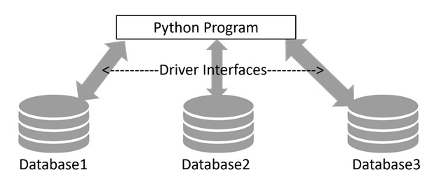
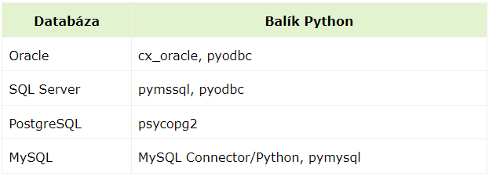
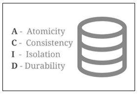

## Prístup k databáze prostredníctvom príkazov pythonu

https://www.tutorialspoint.com/python/python_database_access.htm

Vstupné údaje a aj údaje generované počas vykonávania programu sú uložené v pamäti RAM. Ak však májú byť uložené na trvalo, je potrebné ich preniesť do databázových tabuliek. K dispozícii sú rôzne systémy správy relačných databáz (RDBMS).

* GadFly
* MySQL
* PostgreSQL
* Microsoft SQL Server
* Informix
* Oracle
* Sybase
* SQLite
a mnoho ďalších...

V tejto časti sa naučíme ako pristupovať k databáze pomocou príkazov Pythonu, ako ukladať dáta objektov Python do SQLite databázy a ako získavať dáta z SQLite databázy a spracovávať ich pomocou programu Python.

Relačné databázy používajú na vykonávanie operácií príkazy **SELECT, INSERT, DELETE, a UPDATE** . Ide o príkazy jazyka **SQL** (**S**tructured **Q**uery **L**anguage). Implementácie jazyka SQL v rôžnych SW spoločnostiach sa však navzájom líšia. To vyvoláva problémy s nekompatibilitou. SQL inštrukcie pre jednu databázu sa potom vo väčšej alebo menšej miere nezhodujú s inštrukciami pre inú databázu.

Na prekonanie tejto nekompatibility v oblasti programovacieho jazyka Python bolo navrhnuté spoločné rozhranie uvedený v predpise **PEP** (**P**ython **E**nhancement **Proposal**) 249. Tento návrh sa nazýva **DB-API** a vyžaduje, aby program ovládača (driver) databázy ktorý je používaný na interakciu (interface) s Pythonom bol kompatibilný s DB-API (**D**ata**B**ase-**A**pplication **P**rogramming **I**nterface).

Štandardná knižnica Pythonu obsahuje modul sqlite3, ktorý vlastne predstavuje spomínaný ovládač a ten je kompatibilný s DB_API pre databázu SQLite3. Možno ho tiež považovať za referenčnú t.j. vzorovú implementáciu DB-API.

Keďže požadované rozhranie DB-API je zabudované v SQLite3, môžeme priamo použiť túto databázu SQLite na písanie aplikácii pre Python. Pre iné typy databáz ktoré by sme chceli použiť by sme si muslei nainštalovať príslušný balík pre Python ako ukazuje tabuľka nižšie.

Modul DB-API, ako napríklad sqlite3, obsahuje triedy pripojenia a kurzora. Objekt pripojenia sa získa pomocou metódy connect() a ak je to potrebné zadajú sa pri tom požadované údaje pripojenia, ako je názov servera a číslo portu a používateľské meno a heslo. **Objekt pripojenia** sa stará o otváranie a zatváranie databázy, mechanizmus kontroly transakcií ich potvrdenie (committing) alebo vrátenie (rolling back).

**Objekt kurzora** je získaný z objektu pripojenia a zúčastňuje sa ako rukoväť pri vykonávaní všetkých **CRUD** (**C**reate, **R**ead, **U**pdate, **D**elete) operácií nad databázou.

## Modul sqlite3

SQLite je nenáročná transakčná relačná databáza bez serverov a súborov. Nevyžaduje žiadnu inštaláciu a na prístup k databáze nie sú potrebné žiadne prihlasovacie údaje, ako napríklad používateľské meno a heslo.

Modul sqlite3 Pythonu obsahuje implementáciu DB-API pre databázu SQLite. Napísal ju Gerhard Häring. Poďme sa naučiť, **ako používať modul sqlite3** na prístup k databáze s Pythonom.

>### Začnime importovaním sqlite3 a skontrolujme jeho verziu.
~~~
>>> import sqlite3
>>> sqlite3.sqlite_version

Vysledok:
'3.39.4'
~~~

>### Objekt pripojenia

Objekt pripojenia je nastavený funkciou connect() v module sqlite3. Prvým pozičným argumentom tejto funkcie je reťazec predstavujúci cestu (relatívnu alebo absolútnu) k súboru databázy SQLite. Funkcia vráti objekt pripojenia **conn** odkazujúci na databázu.

~~~
>>> conn=sqlite3.connect('testdb.sqlite3')
>>> type(conn)

Vysledok:
<class 'sqlite3.Connection'>
~~~

V triede pripojenia sú definované rôzne metódy. Jednou z nich je metóda cursor(), ktorá vracia objekt kurzora, o čom sa dozvieme v ďalšej časti. Riadenie transakcie sa vykonáva metódami commit() a rollback() objektu spojenia. Trieda pripojenia má dôležité metódy na definovanie vlastných funkcií a agregátov, ktoré sa majú použiť v dotazoch SQL.

>### Objekt kurzora
Ďalej musíme získať objekt kurzora z objektu spojenia. Je to vaša rukoväť databázy pri vykonávaní akejkoľvek operácie CRUD na databáze. Metóda cursor() na objekte pripojenia vráti objekt kurzora **cur**.

~~~
>>> cur=conn.cursor()
>>> type(cur)

Vysledok:
<class 'sqlite3.Cursor'>
~~~

Teraz môžeme vykonávať všetky operácie SQL dotazov s pomocou jeho metódy execute() dostupnej pre objekt kurzora. Táto metóda vyžaduje reťazcový argument, ktorý musí byť platným príkazom SQL.

>### Vytvorenie databázovej tabuľky

Teraz pridáme tabuľku zamestnancov do našej novovytvorenej databázy 'testdb.sqlite3'. V nasledujúcom skripte zavoláme metódu execute() objektu kurzora, pričom mu dáme reťazec s príkazom CREATE TABLE vo vnútri Za týmto účelom si vytvoríme súbor table.py do ktorého ložíme daný kód a ktorý spustíme.

~~~
import sqlite3
conn=sqlite3.connect('testdb.sqlite3')
cur=conn.cursor()
qry='''
CREATE TABLE Employee (
EmpID INTEGER PRIMARY KEY AUTOINCREMENT,
FIRST_NAME TEXT (20),
LAST_NAME TEXT(20),
AGE INTEGER,
SEX TEXT(1),
INCOME FLOAT
);
'''
try:
   cur.execute(qry)
   print ('Table created successfully')
except:
   print ('error in creating table')
conn.close()
~~~

Po spustení vyššie uvedeného programu sa v aktuálnom pracovnom adresári vytvorí databáza testdb.sqlite3 s tabuľkou Employee.

Môžeme si to overiť výpisom tabuliek z tejto databáze v konzole SQLite 
~~~
sqlite> .open mydb.sqlite
sqlite> .tables

Vysledok:
Employee
~~~
alebo vo VS-Code nakliknutím pravej myši na súbor testdb.sqlite3 a výberom Open With... -> SQLite Viewer

>### Operácia INSERT
Operácia INSERT sa používa keď chcete vytvoriť nové záznamy v databázovej tabuľke.

Príklad
Nasledujúci príklad vykoná príkaz SQL INSERT na vytvorenie záznamu v tabuľke EMPLOYEE. Daný kód vložíme do súboru insert.py
~~~
import sqlite3

conn=sqlite3.connect('testdb.sqlite3')
cur=conn.cursor()
qry="""INSERT INTO EMPLOYEE(FIRST_NAME,   # SQL prikaz
   LAST_NAME, AGE, SEX, INCOME)
   VALUES ('Mac', 'Mohan', 20, 'M', 2000)"""

try:
   cur.execute(qry)
   conn.commit()
   print ('Record inserted successfully')
except:
   conn.rollback()

print ('error in INSERT operation')
conn.close()
~~~

V kóde boli použité príkazy Python-u [try: a except:](https://runestone.academy/ns/books/published/fopp/Exceptions/using-exceptions.html) ktoré sa používajú na testovanie vytvoreného bloku kódu. Zvyčajne je to v prípade ak tento kód obsahuje chyby, ale nemusí to byť pravidlom a môžu byt použite aj v prípade kódu bezchybného. [Tieto príkazy](https://www.w3schools.com/python/python_try_except.asp) sú vzájomne previazané a vykonávané bez spĺňania podmienky za účelom pokračovania vo vykonávania kódu.

Techniku ​​nahrádzania parametrov môžete použiť aj na vykonanie dotazu INSERT nasledovne :

~~~
import sqlite3

conn=sqlite3.connect('testdb.sqlite3')
cur=conn.cursor()

qry="""INSERT INTO EMPLOYEE(FIRST_NAME,
   LAST_NAME, AGE, SEX, INCOME)
   VALUES (?, ?, ?, ?, ?)"""

try:
   cur.execute(qry, ('Makrand', 'Mohan', 21, 'M', 5000))
   conn.commit()
   print ('Record inserted successfully')

except Exception as e:  # pristup k atributom objektu vynimky
   conn.rollback()
   print ('error in INSERT operation')

conn.close()
~~~

Podrobnejšie sa problematikou používania výnimiek zaoberá [tento zdroj](https://docs.python.org/2/tutorial/errors.html) resp. [tento zdroj](https://docs.python.org/2/library/exceptions.html)

>### Operácia READ

Operácia READ v akejkoľvek databáze znamená načítanie niektorých užitočných informácií z databázy.

Po nadviazaní databázového pripojenia ste pripravení zadať dotaz do tejto databázy. Môžete použiť metódu fetchone() na získanie jedného záznamu alebo metódu fetchall() na získanie viacerých hodnôt z databázovej tabuľky.

* fetchone() − Načíta ďalší riadok sady výsledkov dotazu. Množina výsledkov je objekt, ktorý sa vráti, keď sa objekt kurzora použije na dopytovanie tabuľky.

* fetchall() − Načíta všetky riadky v sade výsledkov. Ak už boli niektoré riadky extrahované zo sady výsledkov, načíta zostávajúce riadky zo sady výsledkov.

* rowcount − Toto je atribút len ​​na čítanie a vracia počet riadkov, ktoré boli ovplyvnené metódou execute().

Príklad
V nasledujúcom kóde ktorý vložíme do súboru insert.py objekt kurzora vykoná dotaz SELECT * FROM EMPLOYEE. Výsledný súbor sa získa metódou fetchall(). Všetky záznamy v sade výsledkov vytlačíme pomocou cyklu for.

~~~
import sqlite3

conn=sqlite3.connect('testdb.sqlite3')
cur=conn.cursor()

qry="SELECT * FROM EMPLOYEE"

try:
   # Execute the SQL command
   cur.execute(qry)
   # Fetch all the rows in a list of lists.
   results = cur.fetchall()
   for row in results:
      fname = row[1]
      lname = row[2]
      age = row[3]
      sex = row[4]
      income = row[5]
      # Now print fetched result
      print ("fname={},lname={},age={},sex={},income={}".format(fname, lname, age, sex, income ))
except Exception as e:
   print (e)
   print ("Error: unable to fecth data")

conn.close()
~~~

Program vytvorí nasledujúci výstup :
~~~
fname=Mac,lname=Mohan,age=20,sex=M,income=2000.0
fname=Makrand,lname=Mohan,age=21,sex=M,income=5000.0
~~~

>### Operácia UPDATE

Operácia UPDATE na ľubovoľnej databáze znamená aktualizáciu jedného alebo viacerých záznamov, ktoré sú už v databáze dostupné.

Nasledujúci postup aktualizuje všetky záznamy, ktoré majú príjem=2000. Tu zvýšime príjem o 1000. Pouzijeme na to program napísaný v update.py
~~~
import sqlite3

conn=sqlite3.connect('testdb.sqlite3')
cur=conn.cursor()

qry="UPDATE EMPLOYEE SET INCOME = INCOME+1000 WHERE INCOME=?"

try:
   # Execute the SQL command
   cur.execute(qry, (1000,))
   # Fetch all the rows in a list of lists.
   conn.commit()
   print ("Records updated")
except Exception as e:
   print ("Error: unable to update data")
conn.close()
~~~

Ak potrebujeme aktualizovať jeden alebo viacero konkrétných stĺpcov tabuľky použijeme príkaz podľa nasledovnej syntaxe :
~~~
UPDATE table_name SET column1 = value1, column2 = value2…., column n = value n

WHERE [condition];
~~~

V príklade zapísanom do súboru update01.py vytvoríme tabuľku STUDENT a následne v nej vykonáme aktualizačné operácie aktualizáciou SNAME študenta, ktorého SID je v tabuľke 1. 

~~~
# importing sqlite3 module 
import sqlite3 

# create connection by using object to 
# connect with gfg database 
connection = sqlite3.connect('gfg.db') 

# query to create a table named STUDENT 
connection.execute(''' CREATE TABLE STUDENTS 
		(SID INT PRIMARY KEY	 NOT NULL, 
		SNAME		 TEXT NOT NULL, 
		SAGE		 INT	 NOT NULL, 
		ADDRESS	 CHAR(50)); 
		''') 

# insert query to insert student details 
# in the above table 
connection.execute( 
	"INSERT INTO STUDENTS VALUES (1, 'mohan pavan', 22, 'ponnur' )") 

connection.execute( 
	"INSERT INTO STUDENTS VALUES (2, 'sudheer', 28, 'chebrolu' )") 

connection.execute( 
"INSERT INTO STUDENTS VALUES (3, 'mohan', 22, 'tenali' )") 

# creating cursor object to display all 
# the data in the table 
cursor = connection.execute("SELECT * from STUDENTS") 

# display data 
print('\nOriginal Table:') 
for row in cursor: 
	print(row) 

# update query to update sname to sravan 
# where id = 1 
connection.execute("UPDATE STUDENTS set SNAME = 'sravan' where SID = 1") 

# save the changes 
connection.commit() 

# creating cursor object to display all 
# the data in the table 
cursor = connection.execute("SELECT * from STUDENTS") 

# display data 
print('\nUpdated Table:') 
for row in cursor: 
	print(row) 

~~~

>### Operácia DELETE

Operácia DELETE sa vyžaduje, keď chcete vymazať niektoré záznamy z databázy. Nasleduje postup na vymazanie všetkých záznamov zo ZAMESTNANCA, kde je PRÍJEM menší ako 2000.

~~~
import sqlite3

conn=sqlite3.connect('testdb.sqlite3')
cur=conn.cursor()

qry="DELETE FROM EMPLOYEE WHERE INCOME<?"

try:
   # Execute the SQL command
   cur.execute(qry, (2000,))
   # Fetch all the rows in a list of lists.
   conn.commit()
   print ("Records deleted")
except Exception as e:
   print ("Error: unable to delete data")

conn.close()
~~~

>### Vykonávanie transakcií

Transakcie predstavujú mechanizmus resp. činnosti, ktoré zabezpečujú konzistentnosť údajov. Transakcie majú nasledujúce štyri vlastnosti :

* Atonómnosť - Buď sa transakcia dokončí, alebo sa nestane vôbec nič.
* Konzistentnosť – Transakcia musí začať v konzistentnom stave a ponechať systém v konzistentnom stave.
* Izolácia − Priebežné výsledky transakcie nie sú viditeľné mimo aktuálnej transakcie.
* Trvanlivosť – Po vykonaní transakcie sú účinky trvalé aj po zlyhaní systému.

Python DB-API ver.2.0 poskytuje dve metódy na potvrdenie alebo vrátenie transakcie.

Príklad
Už viete, ako realizovať transakcie. Tu je podobný príklad :

~~~
# Prepare SQL query to DELETE required records
sql = "DELETE FROM EMPLOYEE WHERE AGE > ?"
try:
   # Execute the SQL command
   cursor.execute(sql, (20,))
   # Commit your changes in the database
   db.commit()
except:
   # Rollback in case there is any error
   db.rollback()
~~~
? v SQL príkaze DELETE je zástupný symbol pre parameter ktorý bude zadaný pri vykonaní dotazu cursor.execute(sql, (20,))

V tomto kóde ktory má okrem chýb v syntaze aj chyby funkčné:

* cursor.execute(sql, (20,)): Vykoná SQL dotaz s parametrom 20poskytnutým ako n-tica (20,).
* db.commit(): Potvrdí zmeny v databáze, ak je vymazanie úspešné.
* db.rollback(): Vráti zmeny, ak sa počas vykonávania vyskytne chyba.

Zbiehatelný kód bez chýb najdeme v súbore delet01.py
~~~
import sqlite3      # pridane

# Establish a connection to the database
db = sqlite3.connect('testdb.sqlite3')  # pridane
# Create a cursor object
cursor = db.cursor()                    # pridane

# Prepare SQL query to DELETE required records
sql = "DELETE FROM EMPLOYEE WHERE AGE > ?"
try:
   # Execute the SQL command
   cursor.execute(sql, (20,))
   # Commit your changes in the database
   db.commit()
   print("Deletion successful")      # pridane
   
except sqlite3.Error as e:      # zmenene
# except:
   # Rollback the transaction in case there is any error
   print("SQLite error:", e)
   db.rollback()

finally:                        # pridane
# Close the cursor and database connection
    if 'cursor' in locals():
        cursor.close()
    
    if 'db' in locals():
        db.close()
~~~

>### Operácia COMMIT
Commit je operácia, ktorá dáva zelený signál databáze na dokončenie zmien a po tejto operácii už nie je možné žiadnu zmenu vrátiť späť.

Tu je jednoduchý príkaz na volanie metódy commit.
~~~
db.commit()
~~~

>### Operácia ROLLBACK
Ak nie ste spokojní s jednou alebo viacerými zmenami a chcete tieto zmeny úplne vrátiť späť, použijeme metódu rollback().

Tu je jednoduchý príkaz volania metódy rollback().
~~~
db.rollback()
~~~

## Modul PyMySQL

PyMySQL je rozhranie na pripojenie k databázovému serveru MySQL z Pythonu. Implementuje Python Database API v2.0 a obsahuje čisto Python MySQL klientsku knižnicu. Cieľom PyMySQL je byť náhradnou náhradou za MySQLdb.

>### Inštalácia PyMySQL

Pred ďalším pokračovaním sa uistite, že máte na svojom počítači nainštalovaný [PyMySQL](https://pypi.org/project/pymysql/). Potom stačí zadať do skriptu Python nasledovnź príkaz :
~~~
import PyMySQL
~~~

Ak sa objaví nasledujúci oznam, znamená to, že modul MySQLdb nie je nainštalovaný
~~~
Traceback (most recent call last):
   File "test.py", line 3, in <module>
      Import PyMySQL
ImportError: No module named PyMySQL
~~~

Posledné stabilné vydanie je dostupné na PyPI a možno ho nainštalovať pomocou pip
~~~
pip install PyMySQL
~~~
Poznámka : Uistite sa, že máte oprávnenie root/administrátora na inštaláciu vyššie uvedeného modulu.

>### Pripojenie k databáze MySQL

Pred pripojením k databáze MySQL skontrolujte nasledujúce body :

* Vytvorili ste databázu TESTDB.

* Vytvorili ste tabuľku EMPLOYEE v TESTDB.

* Táto tabuľka obsahuje polia FIRST_NAME, LAST_NAME, AGE, SEX a INCOME.

* Používateľské ID „testuser“ a heslo „test123“ sú nastavené na prístup k TESTDB.

* Modul Python PyMySQL je na vašom počítači správne nainštalovaný.

* Prešli ste si návodom MySQL, aby ste pochopili základy MySQL.

Príklad
Ak chcete použiť databázu MySQL namiesto databázy SQLite v predchádzajúcich príkladoch, musíme zmeniť funkciu connect() nasledovne :
~~~
import PyMySQL
# Open database connection
db = PyMySQL.connect("localhost","testuser","test123","TESTDB" )
~~~

Okrem tejto zmeny je možné každú databázovú operáciu vykonať bez problémov.

>### Spracovanie chýb
Existuje veľa zdrojov chýb. Niekoľko väčšinou je tosyntaktická chyba vo vykonanom príkaze SQL, zlyhanie pripojenia alebo volanie metódy načítania pre už zrušené alebo dokončené ošetrenie SQL príkazu.

DB-API definuje množstvo chýb, ktoré môžu existovať v každom databázovom module. Nasledujúca tabuľka uvádza tieto výnimky.

| Sr.No.    | Výnimka a popis                                                                     |
|-----------|---------------------------------------------------------------------------|
| 1 | **Warning**  Používa sa na nefatálne problémy. Musí podtrieda StandardError.
|2| **Error**  Základná trieda pre chyby. Musí podtrieda StandardError.
|3|**InterfaceError**  Používa sa na chyby v module databázy, nie v samotnej databáze. Musí podtrieda Error.
|4| **DatabaseError**  Používa sa na chyby v databáze. Musí podtrieda Error.
|5| **DataError**  Podtrieda DatabaseError, ktorá odkazuje na chyby v údajoch.
|6| **OperationalError** Podtrieda DatabaseError, ktorá odkazuje na chyby, ako je strata pripojenia k databáze. Tieto chyby sú vo všeobecnosti mimo kontroly skriptovacieho nástroja Python.
|7|**IntegrityError**  Podtrieda DatabaseError pre situácie, ktoré by poškodili integritu vzťahu, ako sú obmedzenia jedinečnosti alebo cudzie kľúče.
|8 | **InternalError**  Podtrieda DatabaseError, ktorá odkazuje na interné chyby databázového modulu, ako napríklad kurzor už nie je aktívny.
|9|**ProgrammingError**  Podtrieda DatabaseError, ktorá odkazuje na chyby, ako je napríklad zlý názov tabuľky a ďalšie veci, ktoré možno bezpečne obviňovať na vás.
|10|**NotSupportedError**  Podtrieda DatabaseError, ktorá odkazuje na pokus o volanie nepodporovanej funkcie.
|
