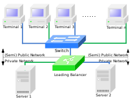
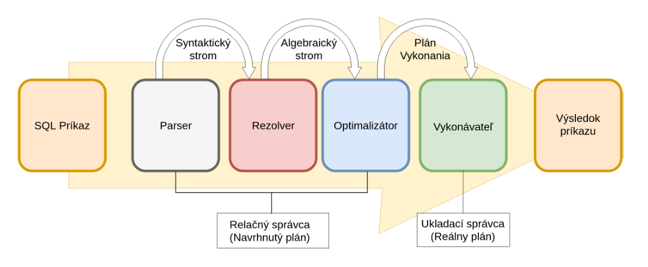
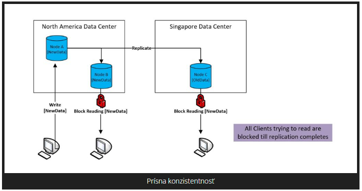

>## Optimalizácia indexovania
**
**Indexy** môžu poskytnúť rýchlejší prístup k údajom. Indexy môžete vytvárať, meniť, monitorovať a rušiť. Indexy sa snažíme menežovať preto aby sme ich optimalizovali a čo najlepšie naplnili ich **funkciu** t.j. **čo najrýchlejší spôsob vyhladávania údajov v databáze**.

Optimalizácia indexovania alebo Datbase index management sa zaoberá riadením indexovania databázy na vlastnostiach udalostí a tokov. Ide predovšetkým o zvýšenie rýchlosťi vyhľadávania ktoré je hlavným kritériom optimalizácie indexovania. V podstate sa snažíme zúžiť celkovú oblasť vyhľadávania na oblasť v ktorej sa nachádza predmet nášho záujmu. Robíme to pridaním indexu do vyhľadávacieho dotazu.

Index predstavuje množinu požiadaviek, ktoré špecifikujú informácie o údajoch v súbore a ich umiestnení v súborovom systéme. Vyhľadávanie je efektívnejšie, pretože systémy, ktoré používajú indexy, nemusia čítať všetky údaje, aby našli zhody. **Index obsahuje odkazy na jedinečné výrazy v údajoch a ich umiestnenie**. Pretože indexy využívajú diskový priestor, úložný priestor možno použiť na skrátenie času vyhľadávania.

Na optimalizáciu vyhľadávania najskôr použijeme názov poľa podľa ktorého budeme zúžime oblasť vyhladávania a potom spôsob vytvorenia indexu (zoradenie: ASC/DSC, porovnanie: RTRIM, NOCASE, BINARY). Indexovanie môžeme povoliť pre akúkoľvek vlastnosť, ktorá je uvedená vo funkcii nastavenia  indexu, a indexovanie môžeme povoliť pre viac ako jednu vlastnosť .

**O indexoch**
Indexy sú voliteľné štruktúry spojené s tabuľkami a cluster-mi (HW a SW prostriedky ktoré vykonávajú rovnaké funkcie pomocou ďalších pridaných HW a SW prostriedkov), ktoré umožňujú rýchlejšie vykonávanie dotazov SQL oproti tabuľke.

Na obrázku je aplikovaná technológia cluster-a na vyrovnávanie záťaže s dvoma servermi a N užívateľskými stanicami. Samozrejme že to predpokladá príslušný SW na oboch serveroch.

**Pokyny pre správu indexov**
Môžete postupovať podľa pokynov pre správu indexov.

**Vytváranie indexov**
Môžete vytvoriť niekoľko rôznych typov indexov. Indexy môžete vytvárať explicitne a môžete vytvárať indexy spojené s obmedzeniami.

**Zmena indexov**
Index môžete zmeniť vykonaním úloh, ako je napríklad zmena charakteristík jeho úložiska, jeho prebudovanie, znefunkčnenie alebo zviditeľnenie alebo neviditeľnosť.

**Monitorovanie využitia priestoru indexmi**
Ak sa kľúčové hodnoty v indexe vkladajú, aktualizujú a vymazávajú často, index môže časom stratiť svoju efektívnosť priestoru.

**Zrušenie indexov**
Pomocou príkazu môžete zrušiť index DROP INDEX.

**Indexy Pohľady údajového slovníka**
Informácie o indexoch môžete dotazovať na sadu zobrazení údajového slovníka.

**Otázky k téme:**
1./ Aký význam a použitie majú indexy v databázových systémoch ?

### Exekučný plán

Sa táka procesu vykonania SQL príkazu ktorý môže byť zadaný cez GUI SW nástroja alebo cez terminálové okno pomocou CLI. Keď vykonávame SQL príkaz tak o najlepšej možnej ceste ako vykonať požadovaný SQL príkaz pre RDBMS rozhoduje systém a SQL procesor zisťuje spôsob ako najlepšie interpretovať danú úlohu. Proces spracovánia príkazu vyzerá nasledovne.Najprv sa prijme SQL príkaz, ktorý sa parsuje (rozloží). Na tento vyparsovaný príkaz sa spustí optimalizačný nástroj,ktorý zistí najlepší spôsob ako príkaz vykonať.Potom to kroku sa vytvorí **exekučný plán**, podľa ktorého sa nájdu odpovedajúce výsledky. Na týchto výsledkoch sa vykoná pôvodná akcia SQL príkazu, čo môže byť napríklad niečo vybrať,vymazať alebo upraviť. Zápis a načítavanie z fyzickej databázy má na starosť správca súborov, ktorý je súčasťou RDBMS. Aby nedošlo k **nekonzistencii** dát,RDBMS používa správcu transakcií, čo znamená,že jednotlivé SQL príkazy sú navzájom nezávislé a ich vykonanie je atonómné.Tento proces je zobrazený na obrázku:

**Parser** - rozkladač je funkcia ktorá rozloží príkaz na dielčie súvisiace časti ako napr. určí ktoré polia sú predmetom spracovania.

**Resolver** - prekladač je funkcia, ktorá je zodpovedná za vyplnenie údajov pre jedno pole v našej tabuľke.

**Optimizator** - optimalizér pripraví vykonávania dielčích častí tak aby vykonávateľ nemusel chaoticky preskakovať a opakovať jednotlivé operácie ale optimalizoval jednotlivé činnosti.

Pojem [konistencie databázy](https://www.decube.io/post/what-is-data-consistency-definition-examples-and-best-practice) je ďalším často používaným a dôležitým pojmom v oblasti DBS. 

### Konzistencia údajov

[Konzistencia údajov](https://www.decube.io/post/what-is-data-consistency-definition-examples-and-best-practice) je kľúčovým aspektom, ktorý **zabezpečuje presnosť a spoľahlivosť údajov**. Ak sú teda údaje nekonzistentné, nie je to v poriadku a údaje nie sú hodnoverné. 

**Konzistencia údajov je presnosť, úplnosť a správnosť údajov uložených v databáze**. Rovnaké údaje vo všetkých súvisiacich systémoch, aplikáciách a databázach sú, keď hovoríme, že údaje sú konzistentné. Nekonzistentné údaje môžu viesť k nesprávnej analýze, rozhodovaniu a výsledkom.

Na analýzu alebo meranie konzistentnosti údajov sa používajú kľúčové metriky, ako je presnosť, úplnosť, aktuálnosť a relevantnosť. Vezmime si príklad finančných informácií nejakej organizácie ktorá ich má uložené v dvoch rôznych databázach. Konzistencia údajov tu znamená, že informácie sú rovnaké v oboch databázach a akékoľvek zmeny vykonané v jednej databáze sa okamžite prejavia v druhej databáze.

**Otázky k téme:**

./ Vysvetlite pojem konzistencie databázy a uvedte príklad.